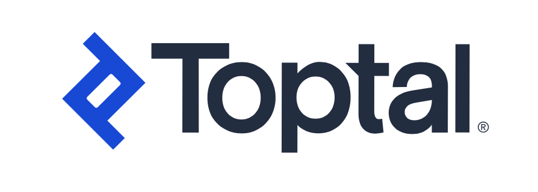

 # **Informe Trabajo Final**

  

<strong>Universidad Peruana de Ciencias Aplicadas</strong>

<strong>Ingeniería de Software</strong> 
Desarrollo de aplicaciones Open Source  
<strong>Profesor: Rafael Oswaldo Castro Veramendi</strong> 

<h2 align="center">INFORME</h2>

<h3 align="center">Startup: BeCode</h3>

<strong>Producto: BeCodeApp</strong>

<h3 align="center">Team Members:</h3>

| **Member**                           | **Code**     |
|--------------------------------------|--------------|
|   Rodrigo Liberato Saldana   |   |
|         |   |
|    Kael Lagos Rivera       |  U202210104 |
|      |   |
|      |    |

<strong>Abril 2025</strong>

# Registro de Versiones del Informe

| Versión | Fecha       | Autor(es)                                                                                                  | Descripción de la modificación                                                                                                                                                       |
|---------|-------------|------------------------------------------------------------------------------------------------------------|---------------------------------------------------------------------------------------------------------------------------------------------------------------------------------------|
| TB1     |   |  | |                                                                                     |

# Project Report Collaboration Insights

TB1: 

# Student Outcome
| Criterio específico                                                                                 | Acciones realizadas | Conclusiones |
|------------------------------------------------------------------------------------------------------|---------------------|--------------|
| **Trabaja en equipo para proporcionar liderazgo en forma conjunta**                                          |              |
| **Crea un entorno colaborativo e inclusivo, establece metas, planifica tareas y cumple objetivos.**                           |                     |              |
|                                                                                                      |                     |              |

# Contenido
- [Registro de Versiones del Informe](#registro-de-versiones-del-informe)
- [Project Report Collaboration Insights](#project-report-collaboration-insights)
- [Student Outcome](#student-outcome)

## Capítulo I: Introducción
- [1.1 Start-up Profile](#11-start-up-profile)
  - [1.1.1. Descripción de la Startup](#111-descripción-de-la-startup)
  - [1.1.2. Perfiles de integrantes del equipo](#112-perfiles-de-integrantes-del-equipo)
- [1.2. Solution Profile](#12-solution-profile)
  - [1.2.1 Antecedentes y problemática](#121-antecedentes-y-problemática)
  - [1.2.2 Lean UX Process](#122-lean-ux-process)
    - [1.2.2.1. Lean UX Problem Statements](#1221-lean-ux-problem-statements)
    - [1.2.2.2. Lean UX Assumptions](#1222-lean-ux-assumptions)
    - [1.2.2.3. Lean UX Hypothesis Statements](#1223-lean-ux-hypothesis-statements)
    - [1.2.2.4. Lean UX Canvas](#1224-lean-ux-canvas)
- [1.3. Segmentos objetivo](#13-segmentos-objetivo)

## Capítulo II: Requirements Elicitation & Analysis
- [2.1. Competidores](#21-competidores)
  - [2.1.1. Análisis competitivo](#211-análisis-competitivo)
  - [2.1.2. Estrategias y tácticas frente a competidores](#212-estrategias-y-tácticas-frente-a-competidores)
- [2.2. Entrevistas](#22-entrevistas)
  - [2.2.1. Diseño de entrevistas](#221-diseño-de-entrevistas)
  - [2.2.2. Registro de entrevistas](#222-registro-de-entrevistas)
  - [2.2.3. Análisis de entrevistas](#223-análisis-de-entrevistas)
- [2.3. Needfinding](#23-needfinding)
  - [2.3.1. User Personas](#231-user-personas)
  - [2.3.2. User Task Matrix](#232-user-task-matrix)
  - [2.3.3. User Journey Mapping](#233-user-journey-mapping)
  - [2.3.4. Empathy Mapping](#234-empathy-mapping)
  - [2.3.5. As-is Scenario Mapping](#235-as-is-scenario-mapping)
- [2.4. Ubiquitous Language](#24-ubiquitous-language)

## Capítulo III: Requirements Specification
- [3.1. To-Be Scenario Mapping](#31-to-be-scenario-mapping)
- [3.2. User Stories](#32-user-stories)
- [3.3. Impact Mapping](#33-impact-mapping)
- [3.4. Product Backlog](#34-product-backlog)

## Capítulo IV: Product Design
- [4.1. Style Guidelines](#41-style-guidelines)
  - [4.1.1. General Style Guidelines](#411-general-style-guidelines)
  - [4.1.2. Web Style Guidelines](#412-web-style-guidelines)
- [4.2. Information Architecture](#42-information-architecture)
  - [4.2.1. Organization Systems](#421-organization-systems)
  - [4.2.2. Labeling Systems](#422-labeling-systems)
  - [4.2.3. SEO Tags and Meta Tags](#423-seo-tags-and-meta-tags)
  - [4.2.4. Searching Systems](#424-searching-systems)
  - [4.2.5. Navigation Systems](#425-navigation-systems)
- [4.3. Landing Page UI Design](#43-landing-page-ui-design)
  - [4.3.1. Landing Page Wireframe](#431-landing-page-wireframe)
  - [4.3.2. Landing Page Mock-up](#432-landing-page-mock-up)
- [4.4. Web Applications UX/UI Design](#44-web-applications-uxui-design)
  - [4.4.1. Web Applications Wireframes](#441-web-applications-wireframes)
  - [4.4.2. Web Applications Wireflow Diagrams](#442-web-applications-wireflow-diagrams)
  - [4.4.2. Web Applications Mock-ups](#442-web-applications-mock-ups)
  - [4.4.3. Web Applications User Flow Diagrams](#443-web-applications-user-flow-diagrams)
- [4.5. Web Applications Prototyping](#45-web-applications-prototyping)
- [4.6. Domain-Driven Software Architecture](#46-domain-driven-software-architecture)
  - [4.6.1. Software Architecture Context Diagram](#461-software-architecture-context-diagram)
  - [4.6.2. Software Architecture Container Diagrams](#462-software-architecture-container-diagrams)
  - [4.6.3. Software Architecture Components Diagrams](#463-software-architecture-components-diagrams)
- [4.7. Software Object-Oriented Design](#47-software-object-oriented-design)
  - [4.7.1. Class Diagrams](#471-class-diagrams)
  - [4.7.2. Class Dictionary](#472-class-dictionary)
- [4.8. Database Design](#48-database-design)
  - [4.8.1. Database Diagram](#481-database-diagram)

  ## Capítulo V: Product Implementation, Validation & Deployment
- [5.1. Software Configuration Management](#51-software-configuration-management)
  - [5.1.1. Software Development Environment Configuration](#511-software-development-environment-configuration)
  - [5.1.2. Source Code Management](#512-source-code-management)
  - [5.1.3. Source Code Style Guide & Conventions](#513-source-code-style-guide--conventions)
  - [5.1.4. Software Deployment Configuration](#514-software-deployment-configuration)
- [5.2. Landing Page, Services & Applications Implementation](#52-landing-page-services--applications-implementation)
  - [5.2.1. Sprint ](#52x-sprint)
    - [5.2.1.1. Sprint Planning n](#5211-sprint-planning-n)
    - [5.2.1.2. Sprint Backlog n](#52x2-sprint-backlog-n)
    - [5.2.1.3. Development Evidence for Sprint Review](#5213-development-evidence-for-sprint-review)
    - [5.2.1.4. Testing Suite Evidence for Sprint Review](#5214-testing-suite-evidence-for-sprint-review)
    - [5.2.1.5. Execution Evidence for Sprint Review](#5215-execution-evidence-for-sprint-review)
    - [5.2.1.6. Services Documentation Evidence for Sprint Review](#5216-services-documentation-evidence-for-sprint-review)
    - [5.2.1.7. Software Deployment Evidence for Sprint Review](#5217-software-deployment-evidence-for-sprint-review)
    - [5.2.1.8. Team Collaboration Insights during Sprint](#5218-team-collaboration-insights-during-sprint)

# Introduccion

# Capitulo 1

## 1.1 Start-Up Profile
### 1.1.1. Descripción de la Startup
BeCode es una plataforma para ayudar a programadores Freelancers y a equipo de programación pequeños a poder encontrar inversores con ideas para que se les pueda desarrollar funcionando como un estilo de Market Place. Asimismo se añadiran funcionalidades para los programadores o inversores que les permita comunicarse abiertamente, definir sus ideas y trabajar en conjunto.

### 1.1.2. Perfiles de integrantes del equipo
| Foto                                 | Alumno            | Descripción                                                                                                                                                                                                                                                                                                                                                                  |
| ------------------------------------ | ----------------- | ---------------------------------------------------------------------------------------------------------------------------------------------------------------------------------------------------------------------------------------------------------------------------------------------------------------------------------------------------------------------------- |
|| Rodrigo Liberato Saldana                  | Soy Rodrigo Liberato, estudiante de Ing. de software. Soy alguien optimista y decido a apoyar a cada miembro del equipo para lograr el mejor resultado. Asimismo, espero que mis habilidades puedan ser de utilidad para completar el trabajo de la forma mas efectiva.                                                                                                                                                                                                                                                                                                                                                                                |
|                                      |                   |                                                                                                                                                                                                                                                                                                                                                                              |
|  | Kael Lagos Rivera | Me llamo Kael Lagos, estudio en la UPC de Monterrico. Tengo muchas ganas de aprender, me considero una persona responsable que busca aprender de sus errores cada vez que puede y tambien me considero alguien que se centra en los detalles. Me comprometo a ayudar a mis compañeros para la elaboración de nuestro trabajo que nos pueda asegurar una buena nota al final. |
|                                      |                   |                                                                                                                                                                                                                                                                                                                                                                              |
|                                      |                   |                                                                                                                                                                                                                                                                                                                                                                              |
|                                      |                   |                                                                                                                                                                                                                                                                                                                                                                              |
## 1.2. Solution Profile

### 1.2.1 Antecedentes y problemática
#### Antecedentes:
Las plataformas de trabajo freelance han evolucionado significativamente desde sus inicios. Empresas como Elance (fundada en 1999) y oDesk (fundada en 2003) fueron pioneras en conectar a freelancers con empleadores en línea. Estas dos compañías se fusionaron en 2013 para formar Elance-oDesk, que posteriormente se rebrandeó como Upwork en 2015. Otra plataforma destacada es Fiverr, lanzada en 2010, que inicialmente ofrecía servicios a partir de $5, permitiendo a los freelancers publicar una variedad de servicios digitales. PeoplePerHour, establecida en 2007 en el Reino Unido, también ha sido una plataforma clave en el mercado freelance.​

Sin embargo se llegaron a identificar varias problematicas que comprometen los servicios de estas aplicaciones, las cuales serian:

- Falta de transparencia y control de calidad: La ausencia de mecanismos efectivos de control de calidad puede llevar a una experiencia inconsistente para los clientes, con trabajos de calidad variable y dificultades para encontrar el profesional adecuado. Esto puede resultar en pérdida de confianza en la plataforma.​

- Altas tarifas y costos adicionales: Muchas plataformas cobran tarifas tanto a freelancers como a empleadores, lo que puede ser costoso para ambas partes. Estas tarifas pueden afectar la rentabilidad y la satisfacción de los usuarios.

- Riesgo de fraude y profesionales no calificados: La falta de procesos de verificación rigurosos puede permitir que individuos sin las habilidades necesarias o con intenciones fraudulentas se registren en la plataforma, lo que puede resultar en trabajos de baja calidad o estafas.

- Problemas de comunicación y compromiso: Dado que muchos freelancers trabajan en múltiples proyectos simultáneamente, pueden surgir problemas relacionados con la falta de compromiso y comunicación efectiva, lo que puede afectar la entrega puntual y la calidad del trabajo.

- Saturación del mercado y competencia intensa: El crecimiento del número de plataformas y freelancers ha llevado a una competencia feroz, lo que dificulta que las plataformas nuevas se destaquen y que los freelancers consigan proyectos adecuados.

- Dependencia de algoritmos y sistemas de revisión: Los freelancers a menudo dependen de sistemas de revisión y algoritmos que pueden ser opacos o injustos, afectando su visibilidad y oportunidades de trabajo. Por ejemplo, cambios en la promoción de servicios debido a "problemas de calidad" no especificados han reducido drásticamente los ingresos de algunos freelancers.​

Estas problemáticas resaltan la importancia de implementar controles de calidad efectivos, estructuras de tarifas transparentes y mecanismos de comunicación claros para garantizar una experiencia satisfactoria tanto para freelancers como para empleadores en las plataformas de trabajo freelance.

Por otro lado, se utilizó la metodología ‘5W y 2H' para describir a detalle el problema que se busca solucionar y los puntos principales respondiendo estas 7 preguntas: ¿qué?, ¿por qué?, ¿a quiénes?, ¿dónde?, ¿cuándo?, ¿cómo?, y ¿cuánto?

- ¿Qué?

¿Qué es BeCode?

BeCode es una plataforma web para contratar programadores freelance o equipos de desarrollo por horas, donde los usuarios puedan contratar mediante membresías.

- ¿Por qué?

¿Por qué es necesario una aplicación como esa?

Porque los programadores necesitan visibilidad justa y acceso a oportunidades sin depender de algoritmos poco claros, y los clientes necesitan seguridad sobre la calidad del servicio sin pagar comisiones excesivas.
Además, hay una saturación de plataformas sin diferenciación real, y muchas no ofrecen modelos flexibles como el pago por membresía o garantías de calidad.

- ¿A quiénes?

¿A quiénes va dirigido la aplicación?

1. Clientes (empresas o particulares) que buscan contratar programadores de calidad sin riesgos ni sobrecostos.

2. Programadores freelance o equipos pequeños que desean vender sus servicios sin depender de algoritmos o pagar comisiones excesivas.

- ¿Dónde?

¿Dónde se puede acceder a la aplicación?

Plataforma web accesible globalmente, con enfoque inicial en mercados emergentes como Latinoamérica, donde hay mucho talento tech freelance, pero pocas plataformas locales robustas.

- ¿Cuándo?

¿Cuándo comienzan sus operaciones?

Durante todo el año, con especial atención a períodos de alta demanda de desarrollo como fines de ciclo académico, lanzamientos de productos (Q2 y Q4) y temporadas de planificación de proyectos (enero, septiembre).

- ¿Cómo?

¿Cómo lograremos darle una identidad propia a nuestra aplicación?

1. Implementando un modelo de membresía para clientes, que cubra los pagos de programadores sin necesidad de comisiones por proyecto.

2. Verificando perfiles mediante tests técnicos, portafolios y entrevistas breves automatizadas.

3. Ofreciendo a los freelancers un perfil tipo Marketplace, donde muestren conocimientos, certificaciones, y tarifas horarias.

4. Usando IA para conectar clientes con programadores compatibles, pero permitiendo búsqueda libre.

5. Con un sistema de garantía de satisfacción (por ejemplo: reembolso o reemplazo del programador en caso de bajo desempeño).

- ¿Cuánto?

¿Cuánto sería el costo de las funciones de la aplicación?

Costo de desarrollo estimado de MVP: $10,000 – $25,000 USD (según funcionalidades y país de desarrollo).

Membresía para clientes: desde $19.99/mes para pequeñas contrataciones, hasta $99.99/mes para empresas con más requerimientos.

Costo para freelancers: sin comisiones por proyecto; solo pago opcional por funcionalidades premium (ej. destacarse en búsquedas, métricas de rendimiento, etc.).

### 1.2.2 Lean UX Process
#### 1.2.2.1. Lean UX Problem Statements

#### 1.2.2.2. Lean UX Problem Assumptions

#### 1.2.2.3. Lean UX Problem Hypothesis Statements

#### 1.2.2.4. Lean UX Problem Canvas

## 1.3. Segmentos objetivo

# Capitulo 2
## 2.1. Competidores
#### Upwork
Upwork es una de las plataformas de trabajo freelance más grandes del mundo. Surgió en 2015 de la fusión de dos competidores: Elance (fundado en 1998) y oDesk (fundado en 2003). Esta unión permitió consolidar el mercado de freelancing bajo una sola plataforma, ofreciendo mayor alcance y funcionalidades mejoradas.

La compañía ha evolucionado para incluir herramientas avanzadas de contratación, colaboración remota y pagos seguros, haciendo que la empresa llegue a su punto mas alto de su historia, actualmente reportando ingresos de $769 millones.

#### Fiverr
Fiverr fue fundada en 2010 en Tel Aviv, Israel, por Micha Kaufman y Shai Wininger. La plataforma se concibió como un mercado en línea donde freelancers pudieran ofrecer servicios digitales, conocidos como "gigs", a partir de $5 USD, de ahí su nombre. A diferencia de plataformas como Upwork, que se centraban en proyectos personalizados, Fiverr adoptó un enfoque de catálogo de servicios estandarizados

Con el tiempo, Fiverr evolucionó para permitir precios más altos y servicios profesionales avanzados, convirtiéndose en una de las plataformas de freelancing más populares del mundo. En 2019, Fiverr salió a bolsa (NYSE: FVRR), consolidando su posición en el mercado.

#### Toptal
Toptal fue fundada en 2010 por Taso Du Val y Breanden Beneschott con el objetivo de crear una plataforma de talento freelance exclusiva para los mejores profesionales del mundo (el nombre proviene de "Top Talent"). A diferencia de Upwork y Fiverr, que son mercados abiertos, Toptal utiliza un riguroso proceso de selección que acepta solo al 3% de los solicitantes, enfocándose en freelancers de élite en desarrollo de software, diseño, finanzas y consultoría. Desde sus inicios, Toptal ha operado como una empresa completamente remota, sin oficinas físicas, lo que le ha permitido acceder a talento global y ofrecer flexibilidad tanto a clientes como a freelancers. En 2016, adquirió la plataforma Skillbridge para expandir su oferta de servicios financieros y de consultoría. Para 2017, Toptal generaba ingresos anuales de aproximadamente $100 millones USD

### 2.1.1. Análisis competitivo

| ***Competidor***          |                                                             | BeCode| Upwork| Fiverr| Toptal|     |
| ------------------------- | ----------------------------------------------------------- | ---------------------------------------------------------------------------------------------------------------------------------------------------------------------------------------------------------------------------------------------------------------------------------------------------------------------------------------------------------------------------------------------------------------------------------------------------------------------------------------------------------------------------------------------------------------------------------------------------------------------------------------------------------------------------- | --------------------------------------------------------------------------------------------------------------------------------------------------------------------------------------------------------------------------------------------------------------------------------------------------------------------------------------------------------------------------------------------------------------------------------------------------------------------------------------------------------------------------------------------------------------------------------------------------------------------------------------------------------------------------------------------------------------------------------------------------------------- | ---------------------------------------------------------------------------------------------------------------------------------------------------------------------------------------------------------------------------------------------------------------------------------------------------------------------------------------------------------------------------------------------------------------------------------------------------------------------------------------------------------------------------------------------------------------------------------------------------------------------------------------- | ---------------------------------------------------------------------------------------------------------------------------------------------------------------------------------------------------------------------------------------------------------------------------------------------------------------------------------------------------------------------------------------------------------------------------------------------------------------------------------------------------------------------------------------------------------------------------------------------------------------------------------- | --- |
| ***Logo***                |                                                             || |  | |     |
| ***Perfil***              | Overview                                                    | Una aplicación web que ofrece servicios para comunicar a freelancers, Startups o mypes con inversionistas que deseen apoyar.                                                                                                                                                                                                                                                                                                                                                                                                                                                                                                                                                | Una aplicación web y móvil que ofrece servicios para comunicar a freelancers, Startups o mypes con inversionistas que deseen apoyar.                                                                                                                                                                                                                                                                                                                                                                                                                                                                                                                                                                                                                           | Una aplicación web y móvil que ofrece servicios para comunicar a freelancers, Startups o mypes con inversionistas que deseen apoyar sus talentos.                                                                                                                                                                                                                                                                                                                                                                                                                                                                                        | Una aplicación web y móvil que ofrece servicios para comunicar a freelancers con grandes habilidades en el rubro de IT o finanzas y Startups con personas que deseen pagar por sus servicios.                                                                                                                                                                                                                                                                                                                                                                                                                                      |     |
|                           | ***Ventaja competitiva ¿Qué valor ofrece a los clientes?*** | Posee un sistema de manejo de proyectos y avances que beneficiara a los proyectos de los clientes para con esto agilizar los trabajos. Asimismo, los tendrán la oportunidad de seleccionar membresías que los beneficiaran en la búsqueda del freelancer con mejor precio/beneficio. Además, de incluir la comunicación activa mediante un chat, videollamadas o intercambio de archivos en un espacio colaborativo totalmente privado. Nuestra mayor oferta es beneficiar a las mypes, startups o nuevos freelancers con guías o tips para que puedan crecer en su ámbito. Por ultimo, ofreceremos la mejor seguridad y privacidad posible para los clientes y freelancers. | Posee un sistema de búsqueda y filtrado avanzado para permitir filtrar habilidades, ubicación, tasa horaria, nivel de experiencia y feedback. Además, posee contratación flexible para contratar por hora o proyectos cortos o largos, chat integrado, videollamadas, intercambio de archivos, espacios colaborativos online. Asimismo, algunas funcionalidades innovadoras, como Time Tracker, que ayuda a registrar automáticamente las horas trabajadas. Talent Makertplace, que sirve para una búsqueda activa de freelancers para tareas personalizadas, su contraparte, Project Catalog, que promociona a freelancers con paquetes o preferencias predefinidos. Y por ultimo, la certificación de habilidades que brindan confiabilidad a los inversores. | Posee el Marketplace de Gigs, donde los freelancers publican sus servicios dependiendo de sus categorías con precios fijos. Junto a esto llegaron los niveles de vendedores que varían según su desempeño, ventas y ratings, todo esto para obtener mayor visibilidad en la red. Asimismo brindan una versión Pro, que ayuda a verificar a los freelancers de alto nivel y que ofrecen servicios especiales. Por ultimo poseen el Fiverr Business, que es una herramienta para gestionar a múltiples freelancers y proyectos simultáneamente, todo esto en conjunto a un chat en linea, sistema de revisiones e intercambio de archivos. | A parte de lo común de facilitar la comunicación y seguimiento de proyectos en tiempo real, la aplicación posee una de los procesos de selección mas rigurosos en este ámbito, donde solamente el 3% de solicitantes freelancers logran ingresar mediante evaluaciones de habilidades blandas, entrevistas y pruebas en vivo para resolver proyectos reales. Además, tiene un enfoque en talentos de alto nivel de desarrolladores, diseñadores, expertos en finanzas y gerentes de productos o proyectos. Por ultimo, la aplicación prioriza la calidad y la excelencia con experiencia, esto la distingue de otras aplicaciones. |     |
| ***Perfil de Marketing*** | ***Mercado objetivo***                                      | Freelancers como desarrolladores, diseñadores, redactores, marketers, etc. Empresas Startups, PYMEs y grandes corporaciones que buscan talento remoto.                                                                                                                                                                                                                                                                                                                                                                                                                                                                                                                       | Freelancers como desarrolladores, diseñadores, redactores, marketers, etc. Empresas Startups, PYMEs y grandes corporaciones que buscan talento remoto.                                                                                                                                                                                                                                                                                                                                                                                                                                                                                                                                                                                                          | Freelancers como desarrolladores, diseñadores, redactores, marketers, etc. Empresas Startups, PYMEs y grandes corporaciones que buscan talento remoto.                                                                                                                                                                                                                                                                                                                                                                                                                                                                                   | Freelancers como desarrolladores, diseñadores, economistas y gerentes de alto nivel. Empresas Startups con gran potencial e industrias que buscan talento remoto.                                                                                                                                                                                                                                                                                                                                                                                                                                                                  |     |
|                           | ***Estrategias de marketing***                              | Publicidad Digital por campañas en Google Ads, redes sociales (LinkedIn, Facebook) y remarketing, ademas de publicidad activa en las redes sociales (Instagram, TikTok, Youtube).                                                                                                                                                                                                                                                                                                                                                                                                                                                                                            | Publicidad Digital por campañas en Google Ads, redes sociales (LinkedIn, Facebook) y remarketing. Asimismo ofrecen contenido educativo en webinars, blogs y guias de freelancing y trabajo remoto. Por ultimo, posee grandes alianzas con empresas, como Coursera para certificar los conocimientos de los freelancers.                                                                                                                                                                                                                                                                                                                                                                                                                                         | Posee publicidad activa en las redes sociales (Instagram, TikTok, Youtube), ademas de colaboraciones con Influencers para promocionar sus servicios. En otros lados también se pueden encontrar contenido en Blogs o guías, además de publicidad en Google Ads o Facebook.                                                                                                                                                                                                                                                                                                                                                         | Publicidad Digital por campañas en Google Ads, redes sociales (LinkedIn, Facebook), haciendo gran remarque en su marca de "top 3%". Brindan informes técnicos de gran valor, webinars y un blog enfocado al reclutamiento tech. Por ultimo, posee grandes alianzas con compañías elite de tecnología alrededor del mundo.                                                                                                                                                                                                                                                                                                          |     |
| ***Perfil de Producto***  | ***Productos & Servicios***                                 | Ofrecen el servicio de ayudar a la comunicacion de freelancers e inversionistas para ofrecerles trabajo. Un Marketplace                                                                                                                                                                                                                                                                                                                                                                                                                                                                                                                                                      | Ofrecen el servicio de ayudar a la comunicacion de freelancers e inversionistas para ofrecerles trabajo. Un Marketplace                                                                                                                                                                                                                                                                                                                                                                                                                                                                                                                                                                                                                                         | Ofrecen el servicio de ayudar a la comunicación de freelancers e inversionistas para ofrecerles trabajo. Un Marketplace                                                                                                                                                                                                                                                                                                                                                                                                                                                                                                                  | Ofrecen el servicio de ayudar a la comunicación de freelancers e inversionistas para ofrecerles trabajo. Un Marketplace                                                                                                                                                                                                                                                                                                                                                                                                                                                                                                            |     |
|                           | ***Precios & Costos***                                      | La mayor parte de servicios, como el publicar los proyectos o perfiles será totalmente gratis, sin embargo, el 5% de los tramites sucedidos en los pagos a freelancers será comisiones para BeCode. Además del añadido de la membresía mensual costara $19.                                                                                                                                                                                                                                                                                                                                                                                                                  | Los precios actuales de los freelancers dependen de sus habilidades y los requerimientos que se les pide en las empresas. Sin embargo, Upwork recibe una comision de estos pagos, un 20% si la paga es de $500, 10% si es de $500 a $10,000 y por ultimo un 5% si es superior a 10,000. Por ultimo, la publicacion de proyectos o trabajos por parte de las empresas es completamente gratis al igual que registrarse en la pagina.                                                                                                                                                                                                                                                                                                                             | Los precios de cada uno de los freelancers varían dependiendo de sus habilidades, pero la Fiverr se queda con un 20% de cada una de las ventas de los Freelancers, sin embargo, si se tiene la versión Pro, el retiro de dinero de la aplicación es completamente gratis.                                                                                                                                                                                                                                                                                                                                                             | La aplicacion no posee comisiones por parte de los freelancers y les dan gran libertad para elegir sus propios precios (En su mayoria estan al rededor de $200). Para las empresas, tienen costos para hacer match con algunos freelancers de elite y hay tarifas de horas desde $60 a $300                                                                                                                                                                                                                                                                                                                                        |     |
|                           | ***Canales de distribución (Web y/o Móvil)***               | Aplicaciones web.                                                                                                                                                                                                                                                                                                                                                                                                                                                                                                                                                                                                                                                            | Aplicaciones web, móvil e integraciones API para grandes empresas tecnológicas.                                                                                                                                                                                                                                                                                                                                                                                                                                                                                                                                                                                                                                                                                 | Aplicaciones web y móvil                                                                                                                                                                                                                                                                                                                                                                                                                                                                                                                                                                                                                 | Aplicaciones web y móvil                                                                                                                                                                                                                                                                                                                                                                                                                                                                                                                                                                                                           |     |
| ***Análisis SWOT***       | ***Fortalezas***                                            | Startup innovadora, precios flexibles, diseño innovador y gran escalabilidad a futuro.                                                                                                                                                                                                                                                                                                                                                                                                                                                                                                                                                                                       | Marca reconocida y confiable en todo el mundo, gran base de usuarios, plataforma escalable y adaptable a distintas industrias y cotiza en bolsa, lo que le permite captar capital fácilmente                                                                                                                                                                                                                                                                                                                                                                                                                                                                                                                                                                    | Modelo sencillo y rápido, gran variedad de servicios creativos y digitales, Sistema de niveles incentiva la calidad y marca reconocida mundialmente.                                                                                                                                                                                                                                                                                                                                                                                                                                                                                     | Filtro riguroso garantiza profesionales top, atrae empresas con presupuestos altos, los freelancers no compiten por proyectos y poseen un branding solido.                                                                                                                                                                                                                                                                                                                                                                                                                                                                         |     |
|                           | ***Debilidades***                                           | Poco conocimiento en el ambito, fuerte competencia con mas experiencia a nivel mundial y sin alianzas que brinden una ventaja competitiva.                                                                                                                                                                                                                                                                                                                                                                                                                                                                                                                                   | Comisiones elevadas para freelancers novatos, fuerte competencia y saturación en algunas categorías.                                                                                                                                                                                                                                                                                                                                                                                                                                                                                                                                                                                                                                                            | Altas comisiones, saturación en categorías populares y menos adecuado para proyectos largos o complejos vs. Upwork.                                                                                                                                                                                                                                                                                                                                                                                                                                                                                                                      | Inaccesible para startups pequeñas o freelancers junior, la selección de talento puede demorar semanas y los freelancers no pueden buscar proyectos activamente                                                                                                                                                                                                                                                                                                                                                                                                                                                                    |     |
|                           | ***Oportunidades***                                         | Expansion a nuevos ambitos a parte del desarrollo de software, integracion de nuevas herramientas como la IA y la poca competencia a nivel de latinoamerica.                                                                                                                                                                                                                                                                                                                                                                                                                                                                                                                 | Expansión hacia nichos de alta especialización, ofrecer mejores herramientas para trabajo colaborativo y gestión de equipos remotos y crecimiento del trabajo remoto post-pandemia                                                                                                                                                                                                                                                                                                                                                                                                                                                                                                                                                                              | Crecimiento de la economía gig y trabajo remoto, expansión de Fiverr Business en el mercado corporativo y Más integraciones con herramientas de productividad.                                                                                                                                                                                                                                                                                                                                                                                                                                                                           | Crecimiento del trabajo remoto en empresas tech, expansión a nuevas industrias y alianzas con universidades y bootcamps.                                                                                                                                                                                                                                                                                                                                                                                                                                                                                                           |     |
|                           | ***Amenazas***                                              | Competencia agresiva que reduce tarifas o comisiones, aplicación potencial a verse en intercambio de información confidencial y problemas entre cliente y freelancer.                                                                                                                                                                                                                                                                                                                                                                                                                                                                                                        | Competencia agresiva que reduce tarifas o comisiones, regulaciones laborales en países que podrían limitar el freelance y problemas de confianza entre cliente y freelancer                                                                                                                                                                                                                                                                                                                                                                                                                                                                                                                                                                                     | Competencia de Upwork, Freelancer.com y mercado local, posible desconfianza por servicios de baja calidad y regulaciones fiscales en diferentes países                                                                                                                                                                                                                                                                                                                                                                                                                                                                                   | Competencia de plataformas similares, fuga de talento tras los freelancers obtienen la experiencia y recesión económica.                                                                                                                                                                                                                                                                                                                                                                                                                                                                                                           |     |

### 2.1.2. Estrategias y tácticas frente a competidores
| ***MATRIZ FODA y C.A.M.E***                                    | **Oportunidades:** Expansion en nuevos ambitos.                                                                                                                                                                  | **Amenazas:** competencia muy agresiva con cambios en las tarifas y comisiones                                                                                                                      |
| -------------------------------------------------------------- | ---------------------------------------------------------------------------------------------------------------------------------------------------------------------------------------------------------------- | --------------------------------------------------------------------------------------------------------------------------------------------------------------------------------------------------- |
| **Fortalezas:** Precios flexibles                              | Gracias a los precios flexibles, mas personas llegaran a considerar la aplicacion como una opcion factible, ademas que gracias a esto se podra ampliar el numero de rubros a los cuales se enfoca la aplicacion. | Debido a nuestros precios flexibles, los competidores podrian hacer muchos cambios en sus tarifas al reconocernos como una amenza, eso solo llevaria a pensar que la startup lo esta haciendo bien. |
| **Debilidades:** Sin alianzas poderosas como los competidores. | La expansión a nuevos ámbitos podría abrir las puertas a alianzas con empresas de otros rubros que podrían estar interesadas en este tipo de aplicaciones.                                                       | Debido a estos cambios en las tarifas las compañías poderosas podrían estar barajeando sus aliados y poder cambiar de bando.                                                                        |
## 2.2. Entrevistas
### 2.2.1. Diseño de entrevistas 
#### Inversores
1. Nombre completo
2. Edad
3. Distrito de residencia
4. Profesión
5. Actualmente, ¿Esta trabajando en algún proyecto?
6. ¿Qué es lo mas difícil de planificar u organizar en un proyecto con gran inversión?
7. ¿Qué piensa los freelancers?
8.  Que es lo que usted busca de un trabajador cuando se trata de los proyectos?
9. ¿Qué opinaría de una aplicación que conecta a freelancers con talento con personas como usted? Estaría dispuesto(a) a usarla?
10.  Que beneficios le gustaría tener a usted dentro de el trato entre usted y los freelancers?
11. Que funcionalidades le gustaría que tenga esta aplicación web?
12. ¿De que manera buscaría hacer esta aplicación segura para usted?

#### Freelancers
1. Nombre completo
2. Edad
3. Distrito de residencia
4. Profesión
5. Actualmente, ¿desde donde trabaja?
6.  Que opina de las ofertas de trabajo actuales en su rubro?
7.  Cuales serian sus prioridades al momento de buscar trabajo?
8.  Alguna vez ha usado alguna aplicación para poder ofrecerse a si mismo a las empresas?
9. ¿Qué opinaría de ser contratado por horas en un proyecto independiente que puede durar unos meses?
10. ¿Qué opinaría de una aplicación que brinde este tipo de servicios?
11. Que funcionalidades cree que debería tener una aplicación como esta?
12. ¿De que manera buscaría hacer esta aplicación segura?

### 2.2.2. Registro de entrevistas
### **Sector Inversores**
Entrevista 1:
----------------------
Nombre:

Capturas:

Link de la entrevista:

Entrevista 2:
----------------------
Nombre:

Capturas:

Link de la entrevista:

Entrevista 3:
----------------------
Nombre:

Capturas:

Link de la entrevista:

Entrevista 4:
----------------------
Nombre:

Capturas:

Link de la entrevista:

Entrevista 5:
----------------------
Nombre:

Capturas:

Link de la entrevista:

----------------------
### **Sector Freelancer**
Entrevista 1:
----------------------
Nombre:

Capturas:

Link de la entrevista:

Entrevista 2:
----------------------
Nombre:

Capturas:

Link de la entrevista:

Entrevista 3:
----------------------
Nombre:

Capturas:

Link de la entrevista:

Entrevista 4:
---------------------
Nombre:

Capturas:

Link de la entrevista:

Entrevista 5:
----------------------
Nombre:

Capturas:

Link de la entrevista:

----------------------
### 2.2.3. Análisis de entrevistas
## 2.3. Needfinding

En la sección de Needfinding, se emplean diversas herramientas como UXPressia, LucidChart y Miro para identificar y comprender las necesidades, comportamientos y emociones de los usuarios potenciales mediante la creación de User Personas, User Task Matrix, User Journey Maps, Empathy Maps y As-Is Scenario Maps. Estos artefactos ayudan a capturar una visión detallada de los usuarios, sus objetivos, tareas y experiencias actuales sin la solución propuesta, lo que permite diseñar un producto alineado con sus expectativas reales. Además, se incluye un glosario de términos del dominio de negocio, garantizando una comunicación clara y coherente entre todos los miembros del equipo.

### 2.3.1. User Personas

Segmento 1: Inversor

Segmento 2: Freelance

### 2.3.2. User Task Matrix

### 2.3.3. User Journey Mapping
### 2.3.4. Empathy Mapping
### 2.3.5. As-is Scenario Mapping
## 2.4. Ubiquitous Language

# Capitulo 3

Este capítulo está dedicado a la especificación de los requisitos de **BeCode**, tanto funcionales como no funcionales. A través de diferentes herramientas de análisis, se define cómo debe comportarse la plataforma para satisfacer las necesidades de los programadores freelance, equipos de desarrollo y clientes o inversores. Se busca garantizar que funcionalidades clave como la validación de perfiles, los modelos de contratación flexibles y la comunicación efectiva entre ambas partes sean implementadas correctamente. Este capítulo establece las bases para el desarrollo de un sistema útil, confiable y eficiente, que promueva relaciones laborales justas y proyectos exitosos dentro del ecosistema digital latinoamericano.
## 3.1. To-Be Scenario Mapping

El **To-Be Scenario Mapping** presenta el escenario futuro ideal después de la implementación de **BeCode**. En este escenario, tanto programadores freelance como clientes o inversores podrán interactuar dentro de la plataforma para conectar, definir proyectos y trabajar de forma colaborativa y eficiente. La plataforma facilitará la contratación mediante membresías, asegurará la calidad a través de verificaciones técnicas, y promoverá la transparencia y comunicación directa entre ambas partes. Este mapa muestra cómo BeCode transformará el modelo actual de plataformas freelance, resolviendo las problemáticas previamente identificadas y optimizando la experiencia para todos los involucrados.

**Segmento Cliente/Inversor**

**Segmento Freelancer/Equipo**

## 3.2. User Stories

Las **User Stories** representan los **requisitos funcionales** de **BeCode** desde la perspectiva de los **desarrolladores freelance** y los **clientes o inversores**. Cada historia de usuario describe una interacción específica que los usuarios necesitan realizar, como _"registrarse como programador y completar su portafolio"_ o _"filtrar programadores por habilidades y experiencia"_. Estas historias se desglosan en tareas concretas que guiarán el desarrollo de la plataforma, asegurando que se cumplan las **necesidades reales y expectativas de los usuarios finales**, y que BeCode brinde una experiencia eficiente, justa y centrada en el valor de las conexiones profesionales.

| **User Story ID** | **Título**                 | **Descripción**                                                                                    | **Criterios de Aceptación**                                                                                                                                                                                                                                                                     | **Epic ID** |
| ----------------- | -------------------------- | -------------------------------------------------------------------------------------------------- | ----------------------------------------------------------------------------------------------------------------------------------------------------------------------------------------------------------------------------------------------------------------------------------------------- | ----------- |
| US-01             | Sección About Us           | Como visitante, quiero conocer más sobre la plataforma BeCode para entender cómo conecta personas. | **Escenario 1:** Visualizar información     Dado que el visitante accede a "About Us"  Entonces se muestra información clara sobre misión, visión y funcionamiento.     **Escenario 2:** Call to Action     Se muestra un botón para registrarse en BeCode.    | EP-01       |
| US-02             | Sección Beneficios         | Como visitante, quiero ver los beneficios de usar BeCode para evaluar si es conveniente para mí.   | **Escenario 1:** Ver beneficios     Dado que el visitante accede a la sección  Entonces se muestran puntos clave como validación de talento, seguridad y flexibilidad.     **Escenario 2:** CTA contextual     Se muestra un botón para unirse a la comunidad. | EP-01       |
| US-03             | Comparación de Membresías  | Como visitante, quiero comparar membresías para elegir la más adecuada.                            | **Escenario 1:** Ver tabla comparativa     Se muestra tabla con precios y beneficios.   **Escenario 2:** Selección de plan     Al seleccionar un plan  Se redirige al registro con el plan preseleccionado.                                                          | EP-01       |
| US-04             | Sección de Contacto        | Como visitante, quiero poder contactar a BeCode desde la landing page para resolver dudas.         | **Escenario 1:** Enviar formulario de contacto     Al enviar, se muestra mensaje de confirmación.     **Escenario 2:** Medios alternativos     Se muestran otras vías de contacto como email o redes.                                                                | EP-01       |
| US-05             | Sección de Testimonios     | Como visitante, quiero leer testimonios de usuarios para conocer su experiencia.                   | **Escenario 1:** Visualizar testimonios     Se muestran experiencias reales.     **Escenario 2:** Filtrar testimonios     Se puede filtrar por tipo de usuario (cliente o desarrollador).                                                                            | EP-01       |
| US-06             | Preguntas Frecuentes (FAQ) | Como visitante, quiero resolver dudas accediendo a la sección de FAQ.                              | **Escenario 1:** Acceso a FAQs     Se muestran preguntas frecuentes.     **Escenario 2:** Derivación a contacto     Si no encuentra respuesta, se redirige al formulario de contacto.                                                                                | EP-01       |
| US-07             | Registro de Freelancers    | Como desarrollador, quiero registrarme para ofrecer mis servicios.                                 | **Escenario 1:** Registro exitoso     Al completar los datos, se crea la cuenta.     **Escenario 2:** Validación de habilidades     Puede completar su perfil técnico y portafolio.                                                                                  | EP-02       |
| US-08             | Registro de Clientes       | Como cliente, quiero registrarme para publicar necesidades de proyectos.                           | **Escenario 1:** Completar registro     Se crea cuenta y accede al dashboard.     **Escenario 2:** Publicar primer proyecto     Se ofrece asistente para publicación inicial.                                                                                        | EP-02       |
| US-09             | Filtrar Freelancers        | Como cliente, quiero filtrar programadores por habilidades o experiencia.                          | **Escenario 1:** Usar filtros avanzados     Puede filtrar por lenguaje, experiencia y país.     **Escenario 2:** Guardar favoritos     Puede guardar perfiles para futuras contrataciones.                                                                           | EP-03       |
| US-10             | Visualización de Proyectos | Como desarrollador, quiero ver proyectos adecuados a mis habilidades.                              | **Escenario 1:** Ver proyectos compatibles     Se muestran proyectos según el perfil.     **Escenario 2:** Postulación sencilla     Puede postularse directamente desde el proyecto con una propuesta personalizada.                                                 | EP-03       |

**EPICS**

Las Epics que identificamos son las siguientes:

**Desarrollo de las Epics**

| **Epic ID** | **Título**                  | **Descripción**                                                                                                                                                                        |
| ----------- | --------------------------- | -------------------------------------------------------------------------------------------------------------------------------------------------------------------------------------- |
| EP-01       | Desarrollo del Landing Page | Se centra en la creación y optimización del sitio web principal que presenta BeCode, incluyendo información clave sobre la plataforma, beneficios, planes y medios de contacto.        |
| EP-02       | Desarrollo del Backend      | Se enfoca en la lógica de negocio, estructuras de datos, endpoints y funcionalidades que permitirán la operación del marketplace, como creación de perfiles, publicaciones y búsqueda. |
| EP-03       | Autenticación y Registro    | Abarca el proceso de registro e inicio de sesión tanto para freelancers como para clientes, asegurando validación, seguridad y flujos diferenciados según el tipo de usuario.          |

## 3.3. Impact Mapping

En la técnica de **Impact Mapping**, conectamos los **objetivos de negocio** con las **soluciones técnicas** de nuestra plataforma BeCode. Esto nos permite identificar a los **actores clave**, como los programadores freelance, equipos pequeños, y los clientes o inversores, y comprender cómo sus acciones impactan en los objetivos comerciales. De esta forma, aseguramos que las funcionalidades que desarrollamos realmente generan valor para el negocio y están alineadas con los resultados esperados, como proporcionar visibilidad justa para los programadores y una experiencia segura y eficiente para los clientes.

_Impact Mapping Cliente/Inversor_

_Impact Mapping Freelancer/Equipo_

## 3.4. Product Backlog

Product Backlog es una herramienta fundamental en el marco de trabajo ágil, particularmente en metodologías como **Scrum**. El backlog actúa como una fuente de verdad que define lo que el equipo de desarrollo necesita trabajar en el producto para entregar valor a los usuarios o clientes.

| **# Orden** | **User Story ID** | **Título**                | **Descripción**                                                                                                                       | **Story Points (1/2/3/5/8)** |
| ----------- | ----------------- | ------------------------- | ------------------------------------------------------------------------------------------------------------------------------------- | ---------------------------- |
| 1           | US-01             | Sección About Us          | Como visitante, quiero conocer más sobre la plataforma BeCode para entender cómo conecta personas y cómo funciona.                    | 5                            |
| 2           | US-02             | Sección Beneficios        | Como visitante, quiero ver los beneficios de usar BeCode para evaluar si es conveniente para mí como cliente o como programador.      | 5                            |
| 3           | US-03             | Comparación de Membresías | Como visitante, quiero comparar las diferentes membresías disponibles para elegir la más adecuada para mis necesidades.               | 5                            |
| 4           | US-04             | Sección de Contacto       | Como visitante, quiero poder contactar a BeCode desde la landing page para resolver dudas sobre el servicio o el proceso de registro. | 5                            |
# Capitulo 4
## 4.1. Style Guidelines
### 4.1.1. General Style Guidelines
### 4.1.2. Web Style Guidelines
## 4.2. Information Architecture
### 4.2.1. Organization Systems
### 4.2.2. Labeling Systems
### 4.2.3. SEO Tags and Meta Tags
### 4.2.4. Searching Systems
### 4.2.5. Navigation Systems
## 4.3. Landing Page UI Design
### 4.3.1. Landing Page Wireframe
### 4.3.2. Landing Page Mock-up
## 4.4. Web Applications UX/UI Design
### 4.4.1. Web Applications Wireframes
### 4.4.2. Web Applications Wireflow Diagrams
### 4.4.2. Web Applications Mock-ups
### 4.4.3. Web Applications User Flow Diagrams
## 4.5. Web Applications Prototyping
## 4.6. Domain-Driven Software Architecture
### 4.6.1. Software Architecture Context Diagram
### 4.6.2. Software Architecture Container Diagrams
### 4.6.3. Software Architecture Components Diagrams
## 4.7. Software Object-Oriented Design
### 4.7.1. Class Diagrams
### 4.7.2. Class Dictionary
## 4.8. Database Design
### 4.8.1. Database Diagram

# Capítulo 5
## 5.1 Software Configuration Management
### 5.1.1 Software Development Environment Configuration
### 5.1.2. Source Code Management.
### 5.1.3. Source Code Style Guide & Conventions.
### 5.1.4. Software Deployment Configuration.
## 5.2. Landing Page, Services & Applications Implementation.
### 5.2.1. Sprint 1
#### 5.2.1.1. Sprint Planning 1.
#### 5.2.1.2. Aspect Leaders and Collaborators.
#### 5.2.1.3. Sprint Backlog 1.
#### 5.2.1.4. Development Evidence for Sprint Review.
#### 5.2.1.5. Execution Evidence for Sprint Review.
#### 5.2.1.6. Services Documentation Evidence for Sprint Review.
#### 5.2.1.7. Software Deployment Evidence for Sprint Review.
#### 5.2.1.8. Team Collaboration Insights during Sprint.
