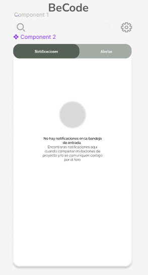
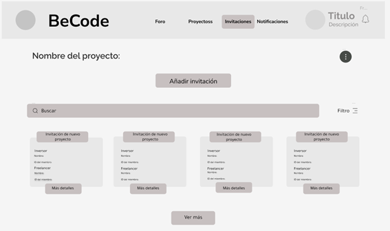
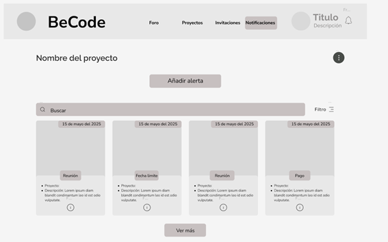

 # **Informe Trabajo Final**

<p align="center">
  
</p>

<p align="center"><strong>Universidad Peruana de Ciencias Aplicadas</strong></p>

<p align="center"><strong>Ingeniería de Software</strong><br>
Desarrollo de aplicaciones Open Source <br>
<strong>Profesor: Rafael Oswaldo Castro Veramendi</strong> </p>

<h2 align="center">INFORME</h2>

<h3 align="center">Startup: BeCode</h3>
<p align="center"><strong>Producto: BeCodeApp</strong></p>

<h3 align="center">Team Members:</h3>

<div align="center">

| **Member**                           | **Code**     |
|--------------------------------------|--------------|
|   Rodrigo Liberato Saldana   | U202215623  |
|   Renato Yauri Chocce      |  U202317566 |
|    Kael Lagos Rivera       |  U202210104 |
|   Adriana Maria Diestra Zambrano   |  U202218110 |
|   Diego Antonio Seijas Vasquez |  U202210167  |

</div>

<p align="center"><strong>Mayo 2025</strong></p>

# Registro de Versiones del Informe

<div align="center">
 
| Versión | Fecha       | Autor(es)                                                                                                  | Descripción de la modificación                                                                                                                                                       |
|---------|-------------|------------------------------------------------------------------------------------------------------------|---------------------------------------------------------------------------------------------------------------------------------------------------------------------------------------|
| TB1     | 26/04/2025  | Rodrigo Liberato, Adriana Diestra, Kael Lagos, Diego Seijas, Renato Yauri|Se añadieron los capítulos del 1 al 5, se desarrollaron las entrevistas junto a sus análisis, se desarrollo un prototipo del Landing Page, se adjuntaron capturas de los gráficos correspondientes a los puntos solicitados y se implementaron las conclusiones junto a sus citas bibliograficas así como sus anexos correspondientes.|                                                                                     |
| TP     | 15/05/2025  | Rodrigo Liberato, Adriana Diestra, Kael Lagos, Diego Seijas, Renato Yauri|Se arreglaron los apartados señalados en la retroalimentación del TB1, además de incluir los nuevos puntos asi como una versión preliminar del Fronted Web Applications.|                                                                                     |
| TB2     | 26/06/2025  | Rodrigo Liberato, Adriana Diestra, Kael Lagos, Diego Seijas, Renato Yauri| |  
</div>

# Project Report Collaboration Insights

URL del repositorio para el informe del TB1: [https://github.com/G5-Open-Source/report.git](https://github.com/G5-Open-Source/report.git)


# Student Outcome
| Criterio específico                                                                                 | Acciones realizadas | Conclusiones |
|------------------------------------------------------------------------------------------------------|---------------------|--------------|
| **Trabaja en equipo para proporcionar liderazgo en forma conjunta**                                          |       <br>Kael Lagos (TB1): Llevo a cabo el desarrollo de la introducción del proyecto, aporto 3 entrevistas para el capítulo 2, desarrollo las conclusiones, incluyó el apartado de bibliografia, incluyó 6 anexos y desarrollo los puntos 4.4.1, 4.4.2, 4.4.3 y 4.4.4, además de desarrollar la pestaña de los foros en el Fronted Web Applications.<br> <br>Kael Lagos (TP): Se llevo a cabo la corrección de la descripción de las entrevistas incluyendo los datos cualitativos que ayudan para el desarrollo del proyecto al identificar patrones comunes.<br> <br>Kael Lagos (TB2): <br>  | <br>Kael Lagos (TB1): Cosidero que este primer paso es muy importante para encaminar nuestro proyecto por el camino adecuado que aseguré nuestro exito en su desarrollo, como cualquier trabajo grupal la comunicación es lo más importante.<br> <br>Kael Lagos (TP): Esta segunda entrega representa un nuevo paso hacia la realización de nuestro proyecto al tomar en cuenta los apartados a mejorar junto a la inclusión del nuevo contenido solicitado, siempre es importante mantener una comunicación constante con el grupo para mantenernos informados en todo momento.<br> <br>Kael Lagos (TB2): <br>
| **Crea un entorno colaborativo e inclusivo, establece metas, planifica tareas y cumple objetivos.**                           |       <br>Kael Lagos (TB1): Solucionó algunos de los errores que se presentaron en el informe además de informar cualquier avance realizado en el trabajo o cualquier modificación hecha a sus compañeros.<br> <br>Kael Lagos (TP): Se solucionó el error de los links a las entrevistas que no funcionaban, además de ampliar la descripción de esas entrevistas junto a sus analisis con tal de no dejar ningún dato por resaltar, además de desarrollar la pestaña de los foros en el Fronted Web Applications.<br> <br>Kael Lagos (TB2): <br>|   <br>Kael Lagos (TB1): Siento que me he comunicado de gran forma con mi grupo, procuré darles una respuesta lo más rápida posible para evitar malentendidos y siempre anunciaba los cambios que le hacia al doc en el cual estabamos trabajando todos.<br> <br> Kael Lagos (TP): Considero que para esta nueva entrega, intente ser más comunicativo con mis compañeros al cuestionar sus avances en el desarrollo de la nueva entrega y tambien mi iniciativa al añadir nuevos apartados al informe que enriquecen su contenido ya de por sí extenso.<br> <br>Kael Lagos (TB2): <br>|
|                                                                                                      |                     |              |
| **Trabaja en equipo para proporcionar liderazgo en forma conjunta**                                          |       <br>Diego Seijas (TB1): Llevo a cabo el desarrollo Total de la landing page , desarrollo del mockup, wireframe,guia de deploy de la pagina/deploy.<br> <br>Diego Seijas (TP): Desarrollo la pantalla del Login y el register del Frontend, además de ayudar a sus compañeros para el desarrollo de las demás partes.<br>  |<br>Diego Seijas (TB1): Cosidero que este primer paso es demasiado importante para encaminar nuestro proyecto ya que la landing page como tal es lo mas general e importante del proyecto, como cualquier trabajo grupal la comunicación es lo más importante.<br> <br>Diego Seijas (TP): Esta segunda entrega funciona como un filtro muy importante, en el cuál ponemos a prueba el desarrollo de nuestra idea. Lo cuál al principio llega a ser algo abrumador, pero con el apoyo de los demás se puede superar.<br>
| **Crea un entorno colaborativo e inclusivo, establece metas, planifica tareas y cumple objetivos.**                           |       <br>Diego Seijas (TB1): Solucionó algunos de los errores que se presentaron en la pagina además de informar cualquier avance realizado en el trabajo o cualquier modificación hecha a sus compañeros.<br> <br>Diego Seijas (TP): Brindo asistencia a los distintos miembros del grupo durante el desarrollo y también informo sobre cualquier cambio desarrollado en el informe.<br>|   <br>Diego Seijas (TB1): Siento que me he comunicado de gran forma con mi grupo, procuré darles una respuesta lo más rápida posible para evitar malentendidos y siempre anunciaba los cambios que le hacia al doc en el cual estabamos trabajando todos.<br> <br>Diego Seijas (TP): Siento que cumplí de buena forma mi rol en el grupo al estar siempre comunicando cualquier cambio en el informe y también al brindar apoyo a quien lo necesitase.<br>           |
|  ||
| **Trabaja en equipo para proporcionar liderazgo en forma conjunta**                                          |       <br>Rodrigo Liberato (TB1): Ayudo con el avance constante del documento y landing page. Asimismo avanzo la presentacion. <br> <br>Rodrigo Liberato (TP): Desarrollo las bases para el desarrollo del Frontend, apoyó en la corrección de los puntos a mejorar mencionados en la retroalimentación y brindo asesoría a sus compañeros.<br>  |<br>Rodrigo Liberato (TB1): Para este tipo de trabajo es muy importante para encaminar nuestro proyecto por el mejor camino, diviendo el trabajo entre los integrantes del equipo.<br> <br>Rodrigo Liberato (TP): Este nuevo desarrollo del trabajo nos dejo en evidencia que siempre habrá algo que debamos mejorar sin importar lo tan bien que esté una cosa, lo cuál no es malo, pues nos permite mejorar en todo momento y a demostrarnos de que los errores son algo común en este tipo de trabajos grupales.<br> 
| **Crea un entorno colaborativo e inclusivo, establece metas, planifica tareas y cumple objetivos.**                           |       <br>Rodrigo Liberato (TB1): Notifico los avances y separar los capitulos para avanzar cada semana.<br> <br>Rodrigo Liberato (TP): Brindo apoyó técnico a sus compañeros durante el desarrollo del Frontend además de organizar al grupo con la repartición de tareas.<br>|   <br>Rodrigo Liberato (TB1): Como equipo hemnos tenido una comunicacion constante y colaborativa para todos los trabajos, ademas que gracias a Github, es mas facil saber quienes logran avanzar a tiempo para no tener retrasos.<br> <br>Rodrigo Liberato (TP): Como cualquier equipo hemos tenido que organizarnos para el desarrollo de los nuevos puntos, lo cuál llegó a suponer un reto. Pero con suficiente dedicación y se logró superar ese obstáculo.<br>           |
| | |  
| **Trabaja en equipo para proporcionar liderazgo en forma conjunta**                                          |       <br>Adriana Diestra (TB1): Durante las reuniones con los miembros del grupo, mostré una participación activa usando un lenguaje comprensible, participé activamente en las entrevistas a usuarios, interpretando y comunicando los resultados de manera.<br> <br>Adriana Diestra (TP): Durante las reuniones de los miembros se mostró muy comprometida al desarrollo del trabajo al preguntar los detalles que no lograba entender del trabajo con tal de que sus compañeros la puedan apoyar al despejarle esas dudas.<br>|<br>Adriana Diestra (TB1): Resalto mi trabajo en equipo y el apoyo mutuo entre todos nuestros compañeros.<br> <br> Adriana Diestra (TP): Destacó mi aporte al grupo al desarrollar el menú para los foros que nuestra propuesta mencionaba entre sus cualidades.<br>     | 
| **Crea un entorno colaborativo e inclusivo, establece metas, planifica tareas y cumple objetivos.**                           |       <br>Adriana Diestra (TB1): Durante el desarrollo del trabajo realizó user personas, user task matrix, user Journey mapping, empathy mapping, as-is scenario mapping, organization systems,  labeling systems, searching and navigation.<br> <br>Adriana Diestra (TP): Ayudó en la elaboración del menú para los foros y apoyo en la corrección de los puntos mencionados a mejorar en la retroalimentación anterior.<br>|   <br>Adriana Diestra (TB1): Equipo logro una meta concreta y llegamos a cumplir todos los objetivos establecidos.<br> <br>Adriana Diestra (TP): Llegamos a cumplir de forma satisfactorio con los nuevos puntos incluyendo el desarrollo de una versión preliminar del Frontend.<br>          |
| | |  
| **Trabaja en equipo para proporcionar liderazgo en forma conjunta**                                          |       <br>Renato Yauri (TB1): Diseñé la base de datos del proyecto, elaboré el diagrama de clases y el diccionario de clases. Además, desarrollé los apartados 1.2.2 Lean UX Process, incluyendo: 1.2.2.1 Lean UX Problem Statements, 1.2.2.2 Lean UX Assumptions, 1.2.2.3 Lean UX Hypothesis Statements, 1.2.2.4 Lean UX Canvas, así como el apartado 1.3 Segmentos objetivo.<br> <br>Renato Yauri (TP): Apoyo en el desarrollo del Frontend al encargarse del desarrollo de las pestañas para el registro y selección de los proyectos en los cuales el usuario puede estar inscrito en esos momentos.<br> |<br>Renato Yauri (TB1): Considero que el desarrollo de una base técnica clara y bien fundamentada fue esencial para que el equipo pudiera avanzar de manera ordenada, asegurando una correcta alineación con los objetivos del proyecto.<br> <br>Renato Yauri (TP): Aporto de gran forma al desarrollo del Frontend, estuvo al tanto de los mensajes que en el grupo llegabamos a compartir para coordinar el desarrollo y apoyo a sus compañeros brindado ayuda cuando lo necesitasen<br>     | 
| **Crea un entorno colaborativo e inclusivo, establece metas, planifica tareas y cumple objetivos.**                           |       <br>Renato Yauri (TB1): Coordiné avances y entregables principalmente con un integrante del equipo, asegurando la integración de mi trabajo técnico en el desarrollo general del proyecto.<br> <br>Renato Yauri (TP): Aporto sus opiniones para el desarrollo del Frontend y en caso llegase a equivocarse, lo corregía inmediatamente para evitar más problemas.<br>|   <br>Renato Yauri (TB1): La comunicación fluida y la disposición para apoyar en lo necesario ayudaron a que el equipo cumpliera los objetivos planteados y mantuviera un flujo de trabajo colaborativo.<br> <br>Renato Yauri (TP): Considero que la comunicación entre los integrantes es un punto muy importante al momento de desarrollar soluciones como la nuestra, debido más que nada a que todos los integrantes deben permanecer informados sobre los distintos avances que hacen sus compañeros para tomarlos en cuenta.<br>         |

# Contenido
- [Registro de Versiones del Informe](#registro-de-versiones-del-informe)
- [Project Report Collaboration Insights](#project-report-collaboration-insights)
- [Student Outcome](#student-outcome)

## Capítulo I: Introducción
- [1.1 Start-up Profile](#11-start-up-profile)
  - [1.1.1. Descripción de la Startup](#111-descripción-de-la-startup)
  - [1.1.2. Perfiles de integrantes del equipo](#112-perfiles-de-integrantes-del-equipo)
- [1.2. Solution Profile](#12-solution-profile)
  - [1.2.1 Antecedentes y problemática](#121-antecedentes-y-problemática)
  - [1.2.2 Lean UX Process](#122-lean-ux-process)
    - [1.2.2.1. Lean UX Problem Statements](#1221-lean-ux-problem-statements)
    - [1.2.2.2. Lean UX Assumptions](#1222-lean-ux-assumptions)
    - [1.2.2.3. Lean UX Hypothesis Statements](#1223-lean-ux-hypothesis-statements)
    - [1.2.2.4. Lean UX Canvas](#1224-lean-ux-canvas)
- [1.3. Segmentos objetivo](#13-segmentos-objetivo)

## Capítulo II: Requirements Elicitation & Analysis
- [2.1. Competidores](#21-competidores)
  - [2.1.1. Análisis competitivo](#211-análisis-competitivo)
  - [2.1.2. Estrategias y tácticas frente a competidores](#212-estrategias-y-tácticas-frente-a-competidores)
- [2.2. Entrevistas](#22-entrevistas)
  - [2.2.1. Diseño de entrevistas](#221-diseño-de-entrevistas)
  - [2.2.2. Registro de entrevistas](#222-registro-de-entrevistas)
  - [2.2.3. Análisis de entrevistas](#223-análisis-de-entrevistas)
- [2.3. Needfinding](#23-needfinding)
  - [2.3.1. User Personas](#231-user-personas)
  - [2.3.2. User Task Matrix](#232-user-task-matrix)
  - [2.3.3. User Journey Mapping](#233-user-journey-mapping)
  - [2.3.4. Empathy Mapping](#234-empathy-mapping)
  - [2.3.5. As-is Scenario Mapping](#235-as-is-scenario-mapping)
- [2.4. Ubiquitous Language](#24-ubiquitous-language)

## Capítulo III: Requirements Specification
- [3.1. To-Be Scenario Mapping](#31-to-be-scenario-mapping)
- [3.2. User Stories](#32-user-stories)
- [3.3. Impact Mapping](#33-impact-mapping)
- [3.4. Product Backlog](#34-product-backlog)

## Capítulo IV: Product Design
- [4.1. Style Guidelines](#41-style-guidelines)
  - [4.1.1. General Style Guidelines](#411-general-style-guidelines)
  - [4.1.2. Web Style Guidelines](#412-web-style-guidelines)
- [4.2. Information Architecture](#42-information-architecture)
  - [4.2.1. Organization Systems](#421-organization-systems)
  - [4.2.2. Labeling Systems](#422-labeling-systems)
  - [4.2.3. SEO Tags and Meta Tags](#423-seo-tags-and-meta-tags)
  - [4.2.4. Searching Systems](#424-searching-systems)
  - [4.2.5. Navigation Systems](#425-navigation-systems)
- [4.3. Landing Page UI Design](#43-landing-page-ui-design)
  - [4.3.1. Landing Page Wireframe](#431-landing-page-wireframe)
  - [4.3.2. Landing Page Mock-up](#432-landing-page-mock-up)
- [4.4. Web Applications UX/UI Design](#44-web-applications-uxui-design)
  - [4.4.1. Web Applications Wireframes](#441-web-applications-wireframes)
  - [4.4.2. Web Applications Wireflow Diagrams](#442-web-applications-wireflow-diagrams)
  - [4.4.2. Web Applications Mock-ups](#442-web-applications-mock-ups)
  - [4.4.3. Web Applications User Flow Diagrams](#443-web-applications-user-flow-diagrams)
- [4.5. Web Applications Prototyping](#45-web-applications-prototyping)
- [4.6. Domain-Driven Software Architecture](#46-domain-driven-software-architecture)
  - [4.6.1. Software Architecture Context Diagram](#461-software-architecture-context-diagram)
  - [4.6.2. Software Architecture Container Diagrams](#462-software-architecture-container-diagrams)
  - [4.6.3. Software Architecture Components Diagrams](#463-software-architecture-components-diagrams)
- [4.7. Software Object-Oriented Design](#47-software-object-oriented-design)
  - [4.7.1. Class Diagrams](#471-class-diagrams)
  - [4.7.2. Class Dictionary](#472-class-dictionary)
- [4.8. Database Design](#48-database-design)
  - [4.8.1. Database Diagram](#481-database-diagram)

  ## Capítulo V: Product Implementation, Validation & Deployment
- [5.1. Software Configuration Management](#51-software-configuration-management)
  - [5.1.1. Software Development Environment Configuration](#511-software-development-environment-configuration)
  - [5.1.2. Source Code Management](#512-source-code-management)
  - [5.1.3. Source Code Style Guide & Conventions](#513-source-code-style-guide--conventions)
  - [5.1.4. Software Deployment Configuration](#514-software-deployment-configuration)
- [5.2. Landing Page, Services & Applications Implementation](#52-landing-page-services--applications-implementation)
  - [5.2.1. Sprint 1](#521-sprint-1)
    - [5.2.1.1. Sprint Planning 1](#5211-sprint-planning-1)
    - [5.2.1.2. Sprint Backlog 1](#5212-sprint-backlog-1)
    - [5.2.1.3. Development Evidence for Sprint Review](#5213-development-evidence-for-sprint-review)
    - [5.2.1.4. Testing Suite Evidence for Sprint Review](#5214-testing-suite-evidence-for-sprint-review)
    - [5.2.1.5. Execution Evidence for Sprint Review](#5215-execution-evidence-for-sprint-review)
    - [5.2.1.6. Services Documentation Evidence for Sprint Review](#5216-services-documentation-evidence-for-sprint-review)
    - [5.2.1.7. Software Deployment Evidence for Sprint Review](#5217-software-deployment-evidence-for-sprint-review)
    - [5.2.1.8. Team Collaboration Insights during Sprint](#5218-team-collaboration-insights-during-sprint)
  - [5.2.2. Sprint 2](#522-sprint-2)
    - [5.2.2.1. Sprint Planning 2](#5221-sprint-planning-2)
    - [5.2.2.2. Aspect Leaders and Collaborators](#5222-aspect-leaders-and-collaborators)
    - [5.2.2.3. Sprint Backlog 2](#5223-sprint-backlog-2)
    - [5.2.2.4. Development Evidence for Sprint Review](#5224-development-evidence-for-sprint-review)
    - [5.2.2.5. Execution Evidence for Sprint Review](#5225-execution-evidence-for-sprint-review)
    - [5.2.2.6. Services Documentation Evidence for Sprint Review](#5226-services-documentation-evidence-for-sprint-review)
    - [5.2.2.7. Software Deployment Evidence for Sprint Review](#5227-software-deployment-evidence-for-sprint-review)
    - [5.2.2.8. Team Collaboration Insights during Sprint](#5228-team-collaboration-insights-during-sprint)
  - [5.2.3. Sprint 3](#523-sprint-3)
    - [5.2.3.1. Sprint Planning 2](#5231-sprint-planning-2)
    - [5.2.3.2. Aspect Leaders and Collaborators](#5232-aspect-leaders-and-collaborators)
    - [5.2.3.3. Sprint Backlog 2](#5233-sprint-backlog-2)
    - [5.2.3.4. Development Evidence for Sprint Review](#5234-development-evidence-for-sprint-review)
    - [5.2.3.5. Execution Evidence for Sprint Review](#5235-execution-evidence-for-sprint-review)
    - [5.2.3.6. Services Documentation Evidence for Sprint Review](#5236-services-documentation-evidence-for-sprint-review)
    - [5.2.3.7. Software Deployment Evidence for Sprint Review](#5237-software-deployment-evidence-for-sprint-review)
    - [5.2.3.8. Team Collaboration Insights during Sprint](#5238-team-collaboration-insights-during-sprint)
- [5.3. Validation Interviews](#53-validation-interviews)
  - [5.3.1. Diseño de entrevistas](#531-diseño-de-entrevistas)
  - [5.3.2. Registro de entrevistas](#532-registro-de-entrevistas)
  - [5.3.3. Evaluaciones según heurísticas](#533-evaluaciones-según-heurísticas)
- [5.4. Video About-the-Product](#54-video-about-the-product)

  
- [Conclusiones](#conclusiones)
- [Bibliografia](#bibliografía)
- [Anexos](#anexos)


# Introduccion

# Capitulo 1

## 1.1 Start-Up Profile
### 1.1.1. Descripción de la Startup
BeCode es una plataforma para ayudar a programadores Freelancers y a equipo de programación pequeños a poder encontrar inversores con ideas para que se les pueda desarrollar funcionando como un estilo de Market Place. Asimismo se añadiran funcionalidades para los programadores o inversores que les permita comunicarse abiertamente, definir sus ideas y trabajar en conjunto.

### 1.1.2. Perfiles de integrantes del equipo
| Foto                                       | Alumno                         | Descripción                                                                                                                                                                                                                                                                                                                                                                  |
| ------------------------------------------ | ------------------------------ | ---------------------------------------------------------------------------------------------------------------------------------------------------------------------------------------------------------------------------------------------------------------------------------------------------------------------------------------------------------------------------- |
|            | Rodrigo Liberato Saldana       | Soy Rodrigo Liberato, estudiante de Ing. de software. Soy alguien optimista y decido a apoyar a cada miembro del equipo para lograr el mejor resultado. Asimismo, espero que mis habilidades puedan ser de utilidad para completar el trabajo de la forma mas efectiva.                                                                                                      |
|                                            |                                |                                                                                                                                                                                                                                                                                                                                                                              |
|        | Kael Lagos Rivera              | Me llamo Kael Lagos, estudio en la UPC de Monterrico. Tengo muchas ganas de aprender, me considero una persona responsable que busca aprender de sus errores cada vez que puede y tambien me considero alguien que se centra en los detalles. Me comprometo a ayudar a mis compañeros para la elaboración de nuestro trabajo que nos pueda asegurar una buena nota al final. |
|            | Adriana Maria Diestra Zambrano | Estudiante de la carrera Ingeniería de Software con interés en el desarrollo web, sobre todo en el lado frontend. Me gusta crear interfaces ordenadas, intuitivas y visualmente atractivas. Proactiva, con gran interés por aprender cosas nuevas y con una actitud positiva que favorece el trabajo en equipo.                                                           |
|                                            |                                |                                                                                                                                                                                                                                                                                                                                                                              |
|  | Diego Seijas Vasquez           | Soy Diego Seijas, estudiante de Ing. de software. Soy alguien lider y decido a apoyar a cada miembro del equipo para lograr el mejor resultado.                                                                                                                                                                                                                              |
|                                            |                                |                                                                                                                                                                                                                                                                                                                                                                              |
|  | Renato Yauri Chocce           | Soy estudiante de Ingeniería de Software cursando el 5to ciclo de mi carrera en la UPC y tengo 21 años. Soy una persona amable y tranquila. Me gusta desarrollar los proyectos de manera minuciosa. En equipo, me esfuerzo por colaborar. Tengo experiencia con C++, Java, JavaScript, html y CSS.                                                                                                                                                                                                                             |
## 1.2. Solution Profile

### 1.2.1 Antecedentes y problemática
#### Antecedentes:
Las plataformas de trabajo freelance han evolucionado significativamente desde sus inicios. Empresas como Elance (fundada en 1999) y oDesk (fundada en 2003) fueron pioneras en conectar a freelancers con empleadores en línea. Estas dos compañías se fusionaron en 2013 para formar Elance-oDesk, que posteriormente se rebrandeó como Upwork en 2015. Otra plataforma destacada es Fiverr, lanzada en 2010, que inicialmente ofrecía servicios a partir de $5, permitiendo a los freelancers publicar una variedad de servicios digitales. PeoplePerHour, establecida en 2007 en el Reino Unido, también ha sido una plataforma clave en el mercado freelance.​

Sin embargo se llegaron a identificar varias problematicas que comprometen los servicios de estas aplicaciones, las cuales serian:

- Falta de transparencia y control de calidad: La ausencia de mecanismos efectivos de control de calidad puede llevar a una experiencia inconsistente para los clientes, con trabajos de calidad variable y dificultades para encontrar el profesional adecuado. Esto puede resultar en pérdida de confianza en la plataforma.​

- Altas tarifas y costos adicionales: Muchas plataformas cobran tarifas tanto a freelancers como a empleadores, lo que puede ser costoso para ambas partes. Estas tarifas pueden afectar la rentabilidad y la satisfacción de los usuarios.

- Riesgo de fraude y profesionales no calificados: La falta de procesos de verificación rigurosos puede permitir que individuos sin las habilidades necesarias o con intenciones fraudulentas se registren en la plataforma, lo que puede resultar en trabajos de baja calidad o estafas.

- Problemas de comunicación y compromiso: Dado que muchos freelancers trabajan en múltiples proyectos simultáneamente, pueden surgir problemas relacionados con la falta de compromiso y comunicación efectiva, lo que puede afectar la entrega puntual y la calidad del trabajo.

- Saturación del mercado y competencia intensa: El crecimiento del número de plataformas y freelancers ha llevado a una competencia feroz, lo que dificulta que las plataformas nuevas se destaquen y que los freelancers consigan proyectos adecuados.

- Dependencia de algoritmos y sistemas de revisión: Los freelancers a menudo dependen de sistemas de revisión y algoritmos que pueden ser opacos o injustos, afectando su visibilidad y oportunidades de trabajo. Por ejemplo, cambios en la promoción de servicios debido a "problemas de calidad" no especificados han reducido drásticamente los ingresos de algunos freelancers.​

Estas problemáticas resaltan la importancia de implementar controles de calidad efectivos, estructuras de tarifas transparentes y mecanismos de comunicación claros para garantizar una experiencia satisfactoria tanto para freelancers como para empleadores en las plataformas de trabajo freelance.

Por otro lado, se utilizó la metodología ‘5W y 2H' para describir a detalle el problema que se busca solucionar y los puntos principales respondiendo estas 7 preguntas: ¿qué?, ¿por qué?, ¿a quiénes?, ¿dónde?, ¿cuándo?, ¿cómo?, y ¿cuánto?

- ¿Qué?

¿Qué es BeCode?

BeCode es una plataforma web para contratar programadores freelance o equipos de desarrollo por horas, donde los usuarios puedan contratar mediante membresías. Asimismo incluiremos una gran garantia de satisfaccion para todos los usuarios que esten dispuestos a usarla.

- ¿Por qué?

¿Por qué es necesario una aplicación como esa?

Porque los programadores necesitan visibilidad justa y acceso a oportunidades sin depender de algoritmos poco claros, y los clientes necesitan seguridad sobre la calidad del servicio sin pagar comisiones excesivas.
Además, hay una saturación de plataformas sin diferenciación real, y muchas no ofrecen modelos flexibles como el pago por membresía o garantías de calidad.

- ¿A quiénes?

¿A quiénes va dirigido la aplicación?

1. Clientes (empresas o particulares) que buscan contratar programadores de calidad sin riesgos ni sobrecostos.

2. Programadores freelance o equipos pequeños que desean vender sus servicios sin depender de algoritmos o pagar comisiones excesivas.

- ¿Dónde?

¿Dónde se puede acceder a la aplicación?

Plataforma web accesible globalmente, con enfoque inicial en mercados emergentes como Latinoamérica, donde hay mucho talento tech freelance, pero pocas plataformas locales robustas.

- ¿Cuándo?

¿Cuándo comienzan sus operaciones?

Durante todo el año, con especial atención a períodos de alta demanda de desarrollo como fines de ciclo académico, lanzamientos de productos (Q2 y Q4) y temporadas de planificación de proyectos (enero, septiembre).

- ¿Cómo?

¿Cómo lograremos darle una identidad propia a nuestra aplicación?

1. Implementando un modelo de membresía para clientes, que cubra los pagos de programadores sin necesidad de comisiones por proyecto.

2. Verificando perfiles mediante tests técnicos, portafolios y entrevistas breves automatizadas.

3. Ofreciendo a los freelancers un perfil tipo Marketplace, donde muestren conocimientos, certificaciones, y tarifas horarias.

4. Usando IA para conectar clientes con programadores compatibles, pero permitiendo búsqueda libre.

5. Con un sistema de garantía de satisfacción (por ejemplo: reembolso o reemplazo del programador en caso de bajo desempeño).

- ¿Cuánto?

¿Cuánto sería el costo de las funciones de la aplicación?

Costo de desarrollo estimado de MVP: $10,000 – $25,000 USD (según funcionalidades y país de desarrollo).

Membresía para clientes: desde $19.99/mes para pequeñas contrataciones, hasta $99.99/mes para empresas con más requerimientos.

Costo para freelancers: sin comisiones por proyecto; solo pago opcional por funcionalidades premium (ej. destacarse en búsquedas, métricas de rendimiento, etc.).

### 1.2.2 Lean UX Process
#### 1.2.2.1. Lean UX Problem Statements
En el ecosistema actual de servicios digitales, muchas personas y empresas requieren soluciones de programación pero no cuentan con una red confiable ni con el conocimiento necesario para encontrar programadores capacitados. Al mismo tiempo, los programadores freelancers —especialmente los que están empezando— enfrentan dificultades para posicionar sus servicios, demostrar su experiencia y conseguir oportunidades laborales estables.

Hemos observado que no existe una plataforma que conecte de manera transparente, directa y confiable a programadores freelancers con personas que necesitan servicios de programación, permitiéndoles colaborar, negociar y generar confianza de forma eficaz.

**¿Cómo podemos conectar a programadores freelancers con potenciales clientes de manera segura, confiable y eficiente, permitiendo que los primeros puedan demostrar su experiencia y que los segundos puedan encontrar soluciones personalizadas y calificadas según sus necesidades?**

#### 1.2.2.2. Lean UX Problem Assumptions
**¿Quién es el usuario?**

1. Programadores freelancers, de nivel junior a senior, que desean ofrecer sus servicios, demostrar su experiencia y ganar visibilidad.

2. Personas o empresas que necesitan soluciones tecnológicas (landing pages, sistemas, bots, APIs, etc.), pero no cuentan con programadores internos. 

**¿Dónde encaja nuestro producto en su vida?**

Para los programadores, la plataforma es un canal para promocionar sus habilidades, conseguir nuevos proyectos y construir su reputación profesional.
Para los interesados, es una vía confiable para encontrar talento técnico, evaluar opciones y contratar con mayor seguridad.

**¿Qué problemas tiene nuestro producto y cómo se pueden resolver?**

- Desconfianza al contratar freelancers por Internet.

  → Solución: sistema de calificaciones, comentarios y verificación de perfiles.

- Difícil visibilidad para nuevos programadores.

  → Solución: membresía premium con perfil destacado y algoritmo que considere actividad reciente, calificación y membresía.

- Dificultad para encontrar al programador adecuado.

  → Solución: sistema de filtros por país, habilidades, servicios ofrecidos y calificación.

- Comunicación dispersa o fuera de la plataforma.

  → Solución: chat interno entre interesados y programadores, con opción de iniciar conversaciones desde publicaciones o perfiles.

**¿Cómo y cuándo es usado nuestro producto?**

Programadores lo usan para actualizar sus perfiles, responder mensajes, revisar ofertas de servicios y recibir solicitudes.
Interesados lo usan cuando necesitan desarrollar un sistema o resolver un problema técnico, y buscan comparar perfiles y contactar a quien mejor se ajuste.

**¿Qué características son importantes?**

- Perfiles detallados con experiencia, habilidades y servicios.

- Publicación de necesidades por parte de los clientes.

- Sistema de comentarios y calificaciones por estrellas.

- Chat interno.

- Filtros de búsqueda.

- Sección de “perfiles favoritos”.

- Membresías con beneficios como posicionamiento prioritario y mensajes ilimitados.

**¿Cómo debe verse nuestro producto y cómo comportarse?**

Diseño moderno, simple y funcional. Interfaz intuitiva, navegación rápida y adaptable a dispositivos móviles. Interacciones fluidas entre usuarios con foco en confianza y facilidad de contratación.

#### 1.2.2.3. Lean UX Problem Hypothesis Statements
- Creemos que al permitir que los programadores freelancers muestren sus habilidades y experiencia en un perfil detallado, lograremos que consigan más contratos.
Sabremos que hemos tenido éxito cuando al menos el 60% de los programadores registrados reciban solicitudes de contacto en su primer mes.

- Creemos que permitir que los interesados publiquen sus necesidades con filtros de búsqueda claros y precisos, aumentará la tasa de coincidencias exitosas.
Sabremos que hemos tenido éxito cuando al menos el 70% de las publicaciones reciban respuesta en las primeras 72 horas.

- Creemos que ofrecer membresías con beneficios como posicionamiento y mensajes ilimitados, incentivará a los usuarios más activos a suscribirse.
Sabremos que hemos tenido éxito cuando al menos el 30% de los usuarios activos adquieran una membresía durante el primer mes.

#### 1.2.2.4. Lean UX Problem Canvas


## 1.3. Segmentos objetivo
**Programadores Freelancers**

Personas con habilidades en programación que buscan trabajar de forma independiente ofreciendo servicios como desarrollo web, móvil, automatización, APIs, entre otros.

Características:

- Desde juniors hasta expertos.

- Buscan visibilidad, proyectos, ingresos y reputación.

- Pueden residir en cualquier parte del mundo.

- Necesitan una plataforma que centralice clientes y los ayude a destacarse.

**Clientes Interesados en Servicios de Programación**

Personas naturales, emprendedores, empresas pequeñas o startups que necesitan soluciones digitales específicas.

Características:

- Requieren un programador para desarrollar o resolver tareas técnicas.

- Buscan confianza, claridad de precios y calidad.

- Prefieren evaluar perfiles y comunicarse directamente.

- Valoran opiniones y calificaciones de otros usuarios.

# Capitulo 2
## 2.1. Competidores
#### Upwork
Upwork es una de las plataformas de trabajo freelance más grandes del mundo. Surgió en 2015 de la fusión de dos competidores: Elance (fundado en 1998) y oDesk (fundado en 2003). Esta unión permitió consolidar el mercado de freelancing bajo una sola plataforma, ofreciendo mayor alcance y funcionalidades mejoradas.

La compañía ha evolucionado para incluir herramientas avanzadas de contratación, colaboración remota y pagos seguros, haciendo que la empresa llegue a su punto mas alto de su historia, actualmente reportando ingresos de $769 millones.

#### Fiverr
Fiverr fue fundada en 2010 en Tel Aviv, Israel, por Micha Kaufman y Shai Wininger. La plataforma se concibió como un mercado en línea donde freelancers pudieran ofrecer servicios digitales, conocidos como "gigs", a partir de $5 USD, de ahí su nombre. A diferencia de plataformas como Upwork, que se centraban en proyectos personalizados, Fiverr adoptó un enfoque de catálogo de servicios estandarizados

Con el tiempo, Fiverr evolucionó para permitir precios más altos y servicios profesionales avanzados, convirtiéndose en una de las plataformas de freelancing más populares del mundo. En 2019, Fiverr salió a bolsa (NYSE: FVRR), consolidando su posición en el mercado.

#### Toptal
Toptal fue fundada en 2010 por Taso Du Val y Breanden Beneschott con el objetivo de crear una plataforma de talento freelance exclusiva para los mejores profesionales del mundo (el nombre proviene de "Top Talent"). A diferencia de Upwork y Fiverr, que son mercados abiertos, Toptal utiliza un riguroso proceso de selección que acepta solo al 3% de los solicitantes, enfocándose en freelancers de élite en desarrollo de software, diseño, finanzas y consultoría. Desde sus inicios, Toptal ha operado como una empresa completamente remota, sin oficinas físicas, lo que le ha permitido acceder a talento global y ofrecer flexibilidad tanto a clientes como a freelancers. En 2016, adquirió la plataforma Skillbridge para expandir su oferta de servicios financieros y de consultoría. Para 2017, Toptal generaba ingresos anuales de aproximadamente $100 millones USD

### 2.1.1. Análisis competitivo

| ***Competidor***          |                                                             | BeCode| Upwork| Fiverr| Toptal|     |
| ------------------------- | ----------------------------------------------------------- | ---------------------------------------------------------------------------------------------------------------------------------------------------------------------------------------------------------------------------------------------------------------------------------------------------------------------------------------------------------------------------------------------------------------------------------------------------------------------------------------------------------------------------------------------------------------------------------------------------------------------------------------------------------------------------- | --------------------------------------------------------------------------------------------------------------------------------------------------------------------------------------------------------------------------------------------------------------------------------------------------------------------------------------------------------------------------------------------------------------------------------------------------------------------------------------------------------------------------------------------------------------------------------------------------------------------------------------------------------------------------------------------------------------------------------------------------------------- | ---------------------------------------------------------------------------------------------------------------------------------------------------------------------------------------------------------------------------------------------------------------------------------------------------------------------------------------------------------------------------------------------------------------------------------------------------------------------------------------------------------------------------------------------------------------------------------------------------------------------------------------- | ---------------------------------------------------------------------------------------------------------------------------------------------------------------------------------------------------------------------------------------------------------------------------------------------------------------------------------------------------------------------------------------------------------------------------------------------------------------------------------------------------------------------------------------------------------------------------------------------------------------------------------- | --- |
| ***Logo***                |                                                             || |  | | |
| ***Perfil***              | Overview                                                    | Una aplicación web que ofrece servicios para comunicar a freelancers, Startups o mypes con inversionistas que deseen apoyar.                                                                                                                                                                                                                                                                                                                                                                                                                                                                                                                                                | Una aplicación web y móvil que ofrece servicios para comunicar a freelancers, Startups o mypes con inversionistas que deseen apoyar.                                                                                                                                                                                                                                                                                                                                                                                                                                                                                                                                                                                                                           | Una aplicación web y móvil que ofrece servicios para comunicar a freelancers, Startups o mypes con inversionistas que deseen apoyar sus talentos.                                                                                                                                                                                                                                                                                                                                                                                                                                                                                        | Una aplicación web y móvil que ofrece servicios para comunicar a freelancers con grandes habilidades en el rubro de IT o finanzas y Startups con personas que deseen pagar por sus servicios.                                                                                                                                                                                                                                                                                                                                                                                                                                      |     |
|                           | ***Ventaja competitiva ¿Qué valor ofrece a los clientes?*** | Posee un sistema de manejo de proyectos y avances que beneficiara a los proyectos de los clientes para con esto agilizar los trabajos. Asimismo, los tendrán la oportunidad de seleccionar membresías que los beneficiaran en la búsqueda del freelancer con mejor precio/beneficio. Además, de incluir la comunicación activa mediante un chat, videollamadas o intercambio de archivos en un espacio colaborativo totalmente privado. Nuestra mayor oferta es beneficiar a las mypes, startups o nuevos freelancers con guías o tips para que puedan crecer en su ámbito. Por ultimo, ofreceremos la mejor seguridad y privacidad posible para los clientes y freelancers. | Posee un sistema de búsqueda y filtrado avanzado para permitir filtrar habilidades, ubicación, tasa horaria, nivel de experiencia y feedback. Además, posee contratación flexible para contratar por hora o proyectos cortos o largos, chat integrado, videollamadas, intercambio de archivos, espacios colaborativos online. Asimismo, algunas funcionalidades innovadoras, como Time Tracker, que ayuda a registrar automáticamente las horas trabajadas. Talent Makertplace, que sirve para una búsqueda activa de freelancers para tareas personalizadas, su contraparte, Project Catalog, que promociona a freelancers con paquetes o preferencias predefinidos. Y por ultimo, la certificación de habilidades que brindan confiabilidad a los inversores. | Posee el Marketplace de Gigs, donde los freelancers publican sus servicios dependiendo de sus categorías con precios fijos. Junto a esto llegaron los niveles de vendedores que varían según su desempeño, ventas y ratings, todo esto para obtener mayor visibilidad en la red. Asimismo brindan una versión Pro, que ayuda a verificar a los freelancers de alto nivel y que ofrecen servicios especiales. Por ultimo poseen el Fiverr Business, que es una herramienta para gestionar a múltiples freelancers y proyectos simultáneamente, todo esto en conjunto a un chat en linea, sistema de revisiones e intercambio de archivos. | A parte de lo común de facilitar la comunicación y seguimiento de proyectos en tiempo real, la aplicación posee una de los procesos de selección mas rigurosos en este ámbito, donde solamente el 3% de solicitantes freelancers logran ingresar mediante evaluaciones de habilidades blandas, entrevistas y pruebas en vivo para resolver proyectos reales. Además, tiene un enfoque en talentos de alto nivel de desarrolladores, diseñadores, expertos en finanzas y gerentes de productos o proyectos. Por ultimo, la aplicación prioriza la calidad y la excelencia con experiencia, esto la distingue de otras aplicaciones. |     |
| ***Perfil de Marketing*** | ***Mercado objetivo***                                      | Freelancers como desarrolladores, diseñadores, redactores, marketers, etc. Empresas Startups, PYMEs y grandes corporaciones que buscan talento remoto.                                                                                                                                                                                                                                                                                                                                                                                                                                                                                                                       | Freelancers como desarrolladores, diseñadores, redactores, marketers, etc. Empresas Startups, PYMEs y grandes corporaciones que buscan talento remoto.                                                                                                                                                                                                                                                                                                                                                                                                                                                                                                                                                                                                          | Freelancers como desarrolladores, diseñadores, redactores, marketers, etc. Empresas Startups, PYMEs y grandes corporaciones que buscan talento remoto.                                                                                                                                                                                                                                                                                                                                                                                                                                                                                   | Freelancers como desarrolladores, diseñadores, economistas y gerentes de alto nivel. Empresas Startups con gran potencial e industrias que buscan talento remoto.                                                                                                                                                                                                                                                                                                                                                                                                                                                                  |     |
|                           | ***Estrategias de marketing***                              | Publicidad Digital por campañas en Google Ads, redes sociales (LinkedIn, Facebook) y remarketing, ademas de publicidad activa en las redes sociales (Instagram, TikTok, Youtube).                                                                                                                                                                                                                                                                                                                                                                                                                                                                                            | Publicidad Digital por campañas en Google Ads, redes sociales (LinkedIn, Facebook) y remarketing. Asimismo ofrecen contenido educativo en webinars, blogs y guias de freelancing y trabajo remoto. Por ultimo, posee grandes alianzas con empresas, como Coursera para certificar los conocimientos de los freelancers.                                                                                                                                                                                                                                                                                                                                                                                                                                         | Posee publicidad activa en las redes sociales (Instagram, TikTok, Youtube), ademas de colaboraciones con Influencers para promocionar sus servicios. En otros lados también se pueden encontrar contenido en Blogs o guías, además de publicidad en Google Ads o Facebook.<br><br>                                                                                                                                                                                                                                                                                                                                                       | Publicidad Digital por campañas en Google Ads, redes sociales (LinkedIn, Facebook), haciendo gran remarque en su marca de "top 3%". Brindan informes técnicos de gran valor, webinars y un blog enfocado al reclutamiento tech. Por ultimo, posee grandes alianzas con compañías elite de tecnología alrededor del mundo.                                                                                                                                                                                                                                                                                                          |     |
| ***Perfil de Producto***  | ***Productos & Servicios***                                 | Ofrecen el servicio de ayudar a la comunicacion de freelancers e inversionistas para ofrecerles trabajo. Un Marketplace                                                                                                                                                                                                                                                                                                                                                                                                                                                                                                                                                      | Ofrecen el servicio de ayudar a la comunicacion de freelancers e inversionistas para ofrecerles trabajo. Un Marketplace                                                                                                                                                                                                                                                                                                                                                                                                                                                                                                                                                                                                                                         | Ofrecen el servicio de ayudar a la comunicación de freelancers e inversionistas para ofrecerles trabajo. Un Marketplace                                                                                                                                                                                                                                                                                                                                                                                                                                                                                                                  | Ofrecen el servicio de ayudar a la comunicación de freelancers e inversionistas para ofrecerles trabajo. Un Marketplace                                                                                                                                                                                                                                                                                                                                                                                                                                                                                                            |     |
|                           | ***Precios & Costos***                                      | La mayor parte de servicios, como el publicar los proyectos o perfiles será totalmente gratis, sin embargo, el 5% de los tramites sucedidos en los pagos a freelancers será comisiones para BeCode. Además del añadido de la membresía mensual costara $19.                                                                                                                                                                                                                                                                                                                                                                                                                  | Los precios actuales de los freelancers dependen de sus habilidades y los requerimientos que se les pide en las empresas. Sin embargo, Upwork recibe una comision de estos pagos, un 20% si la paga es de $500, 10% si es de $500 a $10,000 y por ultimo un 5% si es superior a 10,000. Por ultimo, la publicacion de proyectos o trabajos por parte de las empresas es completamente gratis al igual que registrarse en la pagina.                                                                                                                                                                                                                                                                                                                             | Los precios de cada uno de los freelancers varían dependiendo de sus habilidades, pero la Fiverr se queda con un 20% de cada una de las ventas de los Freelancers, sin embargo, si se tiene la versión Pro, el retiro de dinero de la aplicación es completamente gratis.<br>                                                                                                                                                                                                                                                                                                                                                            | La aplicacion no posee comisiones por parte de los freelancers y les dan gran libertad para elegir sus propios precios (En su mayoria estan al rededor de $200). Para las empresas, tienen costos para hacer match con algunos freelancers de elite y hay tarifas de horas desde $60 a $300                                                                                                                                                                                                                                                                                                                                        |     |
|                           | ***Canales de distribución (Web y/o Móvil)***               | Aplicaciones web.                                                                                                                                                                                                                                                                                                                                                                                                                                                                                                                                                                                                                                                            | Aplicaciones web, móvil e integraciones API para grandes empresas tecnológicas.                                                                                                                                                                                                                                                                                                                                                                                                                                                                                                                                                                                                                                                                                 | Aplicaciones web y móvil                                                                                                                                                                                                                                                                                                                                                                                                                                                                                                                                                                                                                 | Aplicaciones web y móvil                                                                                                                                                                                                                                                                                                                                                                                                                                                                                                                                                                                                           |     |
| ***Análisis SWOT***       | ***Fortalezas***                                            | Startup innovadora, precios flexibles, diseño innovador y gran escalabilidad a futuro.                                                                                                                                                                                                                                                                                                                                                                                                                                                                                                                                                                                       | Marca reconocida y confiable en todo el mundo, gran base de usuarios, plataforma escalable y adaptable a distintas industrias y cotiza en bolsa, lo que le permite captar capital fácilmente                                                                                                                                                                                                                                                                                                                                                                                                                                                                                                                                                                    | Modelo sencillo y rápido, gran variedad de servicios creativos y digitales, Sistema de niveles incentiva la calidad y marca reconocida mundialmente.                                                                                                                                                                                                                                                                                                                                                                                                                                                                                     | Filtro riguroso garantiza profesionales top, atrae empresas con presupuestos altos, los freelancers no compiten por proyectos y poseen un branding solido.                                                                                                                                                                                                                                                                                                                                                                                                                                                                         |     |
|                           | ***Debilidades***                                           | Poco conocimiento en el ambito, fuerte competencia con mas experiencia a nivel mundial y sin alianzas que brinden una ventaja competitiva.                                                                                                                                                                                                                                                                                                                                                                                                                                                                                                                                   | Comisiones elevadas para freelancers novatos, fuerte competencia y saturación en algunas categorías.                                                                                                                                                                                                                                                                                                                                                                                                                                                                                                                                                                                                                                                            | Altas comisiones, saturación en categorías populares y menos adecuado para proyectos largos o complejos vs. Upwork.                                                                                                                                                                                                                                                                                                                                                                                                                                                                                                                      | Inaccesible para startups pequeñas o freelancers junior, la selección de talento puede demorar semanas y los freelancers no pueden buscar proyectos activamente                                                                                                                                                                                                                                                                                                                                                                                                                                                                    |     |
|                           | ***Oportunidades***                                         | Expansion a nuevos ambitos a parte del desarrollo de software, integracion de nuevas herramientas como la IA y la poca competencia a nivel de latinoamerica.                                                                                                                                                                                                                                                                                                                                                                                                                                                                                                                 | Expansión hacia nichos de alta especialización, ofrecer mejores herramientas para trabajo colaborativo y gestión de equipos remotos y crecimiento del trabajo remoto post-pandemia                                                                                                                                                                                                                                                                                                                                                                                                                                                                                                                                                                              | Crecimiento de la economía gig y trabajo remoto, expansión de Fiverr Business en el mercado corporativo y Más integraciones con herramientas de productividad.                                                                                                                                                                                                                                                                                                                                                                                                                                                                           | Crecimiento del trabajo remoto en empresas tech, expansión a nuevas industrias y alianzas con universidades y bootcamps.                                                                                                                                                                                                                                                                                                                                                                                                                                                                                                           |     |
|                           | ***Amenazas***                                              | Competencia agresiva que reduce tarifas o comisiones, aplicación potencial a verse en intercambio de información confidencial y problemas entre cliente y freelancer.                                                                                                                                                                                                                                                                                                                                                                                                                                                                                                        | Competencia agresiva que reduce tarifas o comisiones, regulaciones laborales en países que podrían limitar el freelance y problemas de confianza entre cliente y freelancer                                                                                                                                                                                                                                                                                                                                                                                                                                                                                                                                                                                     | Competencia de Upwork, Freelancer.com y mercado local, posible desconfianza por servicios de baja calidad y regulaciones fiscales en diferentes países                                                                                                                                                                                                                                                                                                                                                                                                                                                                                   | Competencia de plataformas similares, fuga de talento tras los freelancers obtienen la experiencia y recesión económica.                                                                                                                                                                                                                                                                                                                                                                                                                                                                                                           |     |

### 2.1.2. Estrategias y tácticas frente a competidores
| ***MATRIZ FODA y C.A.M.E***                                    | **Oportunidades:** Expansion en nuevos ambitos.                                                                                                                                                                  | **Amenazas:** competencia muy agresiva con cambios en las tarifas y comisiones                                                                                                                      |
| -------------------------------------------------------------- | ---------------------------------------------------------------------------------------------------------------------------------------------------------------------------------------------------------------- | --------------------------------------------------------------------------------------------------------------------------------------------------------------------------------------------------- |
| **Fortalezas:** Precios flexibles                              | Gracias a los precios flexibles, mas personas llegaran a considerar la aplicacion como una opcion factible, ademas que gracias a esto se podra ampliar el numero de rubros a los cuales se enfoca la aplicacion. | Debido a nuestros precios flexibles, los competidores podrian hacer muchos cambios en sus tarifas al reconocernos como una amenza, eso solo llevaria a pensar que la startup lo esta haciendo bien. |
| **Debilidades:** Sin alianzas poderosas como los competidores. | La expansión a nuevos ámbitos podría abrir las puertas a alianzas con empresas de otros rubros que podrían estar interesadas en este tipo de aplicaciones.                                                       | Debido a estos cambios en las tarifas las compañías poderosas podrían estar barajeando sus aliados y poder cambiar de bando.                                                                        |
## 2.2. Entrevistas
### 2.2.1. Diseño de entrevistas 
#### Inversores
1. Nombre completo
2. Edad
3. Distrito de residencia
4. Profesión
5. Actualmente, ¿Esta trabajando en algún proyecto?
6. ¿Qué es lo mas difícil de planificar u organizar en un proyecto con gran inversión?
7. ¿Qué piensa los freelancers?
8.  Que es lo que usted busca de un trabajador cuando se trata de los proyectos?
9. ¿Qué opinaría de una aplicación que conecta a freelancers con talento con personas como usted? Estaría dispuesto(a) a usarla?
10.  Que beneficios le gustaría tener a usted dentro de el trato entre usted y los freelancers?
11. Que funcionalidades le gustaría que tenga esta aplicación web?
12. ¿De que manera buscaría hacer esta aplicación segura para usted?


#### Freelancers
1. Nombre completo
2. Edad
3. Distrito de residencia
4. Profesión
5. Actualmente, ¿desde donde trabaja?
6.  Que opina de las ofertas de trabajo actuales en su rubro?
7.  Cuales serian sus prioridades al momento de buscar trabajo?
8.  Alguna vez ha usado alguna aplicación para poder ofrecerse a si mismo a las empresas?
9. ¿Qué opinaría de ser contratado por horas en un proyecto independiente que puede durar unos meses?
10. ¿Qué opinaría de una aplicación que brinde este tipo de servicios?
11. Que funcionalidades cree que debería tener una aplicación como esta?
12. ¿De que manera buscaría hacer esta aplicación segura?

### 2.2.2. Registro de entrevistas
### **Sector Inversores**
Entrevista 1:
----------------------
Nombre: Roberto Carlos Figueroa

Capturas: <p align="center">
  
</p>

<p align="center">
  
</p>

Descripción: Para esta entrevista perteneciente al sector de inversores, se le cuestionó al señor Roberto Carlos Figueroa sobre los distintos retos que enfrenta al momento de encontrar a jovenes que puedan desarrollar los trabajos que se le asignan. Más que nada por la poca confianza que presentan algunos o la perdida de efectivo al ver como el trabajo no fue desarrollado según lo acordado, en la entrevista se busca evidenciar estos aspectos y tambien se le pregunta su opinión sobre algunas caracteristicas que le gustaria ver en una aplicación que busque arreglar estas carencias. Según lo visto en las respuestas, se pueden sacar las siguientes conclusiones: Busca alguna garantia o seguridad al momento de contratar a algún freelancer que sea desconocido para ellos, valora en gran medida tanto el tiempo como la eficiencia en los desarrollos que él dirige, se llega a sentir más seguro al ver portafolios muy bien presentados en los cuales se puedan ver sus trabajos anteriores y la experiencia que ellos tienen. 

Link de la entrevista: https://upcedupe-my.sharepoint.com/:v:/g/personal/u202210104_upc_edu_pe/ETEPgWB_PNpHnnNq7M0v1a0Bq9KLEf13R_26KDh3-W2Pxw?nav=eyJyZWZlcnJhbEluZm8iOnsicmVmZXJyYWxBcHAiOiJTdHJlYW1XZWJBcHAiLCJyZWZlcnJhbFZpZXciOiJTaGFyZURpYWxvZy1MaW5rIiwicmVmZXJyYWxBcHBQbGF0Zm9ybSI6IldlYiIsInJlZmVycmFsTW9kZSI6InZpZXcifX0%3D&e=Flnx61

Entrevista 2:
---------------------
Nombre: Arturo Salinas

Capturas:


Descripción: Se entrevisto al señor Arturo Salinas, el cual ejerce como gestor de proyectos, acerca de su experiencia trabajando con freelancers y nos brindó algunas recomendaciones que nuestra aplicación deberia de tener para asegurar su impacto en el mercado. Entre las cosas más destacadas que comento se encuentran cosas como: La falta de profesionalismo al momento en que los freelancers contratados informen sobre sus avances o entreguen el trabajo antes de la fecha límite, la molestia que supone coordinar a equipos simultaneos o que no puedan comunicarse entre sí ocasionando la falta de una correcta organización, la experiencia como tal no es valida si acaso esa persona no presenta interés en que su trabajo esté desarrollado de buena forma, no son del todo confiables aquellas personas que inventan excusas al momento de asignarles una parte del desarrollo y que no suele confiar en freelancers que no cuenten con un perfíl detallado sobre sus trabajos anteriores junto a si acaso lograron alcanzar el resultado esperado.

Link de la entrevista: https://upcedupe-my.sharepoint.com/:v:/g/personal/u202215623_upc_edu_pe/ERg2A9-SC5ZMloZJ_sp-5T8BkzQn778j_t5QtH5qM3vMxQ?nav=eyJyZWZlcnJhbEluZm8iOnsicmVmZXJyYWxBcHAiOiJPbmVEcml2ZUZvckJ1c2luZXNzIiwicmVmZXJyYWxBcHBQbGF0Zm9ybSI6IldlYiIsInJlZmVycmFsTW9kZSI6InZpZXciLCJyZWZlcnJhbFZpZXciOiJNeUZpbGVzTGlua0NvcHkifX0&e=noMDca

Entrevista 3:
----------------------
Nombre: Santiago Mena Adriazen

Capturas:


Descripción: Se entrevisto a otro gestor de proyectos, en este caso al señor Santiago Mena Adriazen, que brinda comentarios acerca de las funcionalidades que deberiamos de agregar a la aplicacion ademas de guiarnos un poco mas al rumbo que debemos enfocarnos. Según lo que comentó durante la entrevista, entre las cosas que destacó fueron aspectos como la confianza en los desarrolladores contratados debido a que no siempre son capaces de complir el trabajo que se les asigno muy a pesar de brindarles un tiempo de desarrollo justo, se le dificulta encontrar un medio que garantice la seguridad del cliente al momento de contratar a un freelancer más que nada porque considera que en la actualidad los freelancers son vistos como desarrolladores muy informales que representan un gran riesgo al momento de asignarles un proyecto, matizó que en ocasiones se encuentra a un freelancer que posea un buen expediente pero que suele ser en muy pocos casos y también comentó que le gustaria contar con alguna forma de verificar a la persona que está contratando con tal de asegurar la confiabilidad entre los dos con tal de evitar trabajos mal realizados o incompletos. 

Link de la entrevista: https://upcedupe-my.sharepoint.com/:v:/g/personal/u202215623_upc_edu_pe/EVa0oKq5V4hNqMY6MpJItYgBrZWmAH2X_H5WX1CeZuBM9g?nav=eyJyZWZlcnJhbEluZm8iOnsicmVmZXJyYWxBcHAiOiJPbmVEcml2ZUZvckJ1c2luZXNzIiwicmVmZXJyYWxBcHBQbGF0Zm9ybSI6IldlYiIsInJlZmVycmFsTW9kZSI6InZpZXciLCJyZWZlcnJhbFZpZXciOiJNeUZpbGVzTGlua0NvcHkifX0&e=pBt7h0


----------------------
### **Sector Freelancer**
Entrevista 1:
----------------------
Nombre: Rodrigo Espezua

Capturas: <p align="center">
  
</p>

<p align="center">
  
</p>

Descripción: En este video, se encuentra la entrevista realizada a nuestro compañero Rodrigo Espezua el cual figura como un desarrollador freelancer. Se le hicieron un total de 12 preguntas en las cuales le cuestionabamos ciertos aspectos relacionados a su rubro, las cosas más destacadas que llegó a comentar fueron: La falta de una tarifa justa al momento de aceptar un proyecto que requiere de una gran experiencia, escases de detalles por parte del cliente sobre que es lo que quiere en su proyecto, la poca confianza que tienen los inversores hacia un desarrollador freelancer, la poca seguridad que presentan otras plataformas al momento de entablar un trato con los inversionistas considerando la garantía y la fuerte necesidad en que se incluya un sistema de perfiles para los freelancers debido a que buscan ganarse la confianza de los inversionistas al mostrar sus trabajos anteriores o plasmar las cosas que sabe manejar.

Link de la entrevista: https://upcedupe-my.sharepoint.com/:v:/g/personal/u202210104_upc_edu_pe/EfgZDx8avzJEtrZ8pxw4OfwBVztqGqJU1ySxYRBXgeIxvQ?e=L54ysF&nav=eyJyZWZlcnJhbEluZm8iOnsicmVmZXJyYWxBcHAiOiJTdHJlYW1XZWJBcHAiLCJyZWZlcnJhbFZpZXciOiJTaGFyZURpYWxvZy1MaW5rIiwicmVmZXJyYWxBcHBQbGF0Zm9ybSI6IldlYiIsInJlZmVycmFsTW9kZSI6InZpZXcifX0%3D

Entrevista 2:
----------------------
Nombre: Zuriel Andrea Rivera

Capturas: <p align="center">
  
</p>

<p align="center">
  
</p>

Descripción: Se entrevisto a la desarrolladora freelancer Zuriel Andrea Rivera, la cual nos brindó hablo un poco de las experiencias que tuvo al aceptar trabajos para el desarrollo de proyectos que normalmente están relacionado con fines de entretenimiento, aunque tambien suele aceptar trabajos formales. Se le hicieron un total de 12 preguntas y entre las cosas que más destaco fueron apartados como: La falta de respuestas en los inversionistas al momento de cancelar el pago, la poca claridad que presentan al brindar detalles sobre el proyecto que desean ver realizado, la necesidad de contar con un medio para comunicarse de forma segura con sus compañeros de desarrollo en caso se trabaje con más personas y la falta de perfiles que brinden información sobre los desarrolladores con tal de ganarse la confianza de los inversionistas debido principalmente a lo mal vistos que son los freelancers hoy en día al considerarlos desarrolladores informales que no son dignos de confianza, eso es algo que ella espera se pueda resolver en un futuro cercano.

Link de la entrevista: https://upcedupe-my.sharepoint.com/:v:/g/personal/u202210104_upc_edu_pe/EYbqz47T3oxMgJUprQ0oZdsBCviN1yAxNa9mxcUNmp64YQ?nav=eyJyZWZlcnJhbEluZm8iOnsicmVmZXJyYWxBcHAiOiJTdHJlYW1XZWJBcHAiLCJyZWZlcnJhbFZpZXciOiJTaGFyZURpYWxvZy1MaW5rIiwicmVmZXJyYWxBcHBQbGF0Zm9ybSI6IldlYiIsInJlZmVycmFsTW9kZSI6InZpZXcifX0%3D&e=mO9WVz

Entrevista 3:
----------------------
Nombre: Cielo Rafaile

Capturas: 


Descripción: Se entrevistó a una diseñadora UX/UI freelance, quien compartió su experiencia trabajando desde casa y usando plataformas digitales para conseguir proyectos. Comentó sobre los desafíos actuales en su rubro, como la baja valoración del trabajo creativo y la fuerte competencia en apps globales. Además, destacó la importancia de la flexibilidad, pagos justos y la claridad en los acuerdos. Finalmente, brindó recomendaciones clave para una aplicación de este tipo, como perfiles verificados y sistema de pagos seguro.

Link de la entrevista: https://upcedupe-my.sharepoint.com/:v:/g/personal/u202218110_upc_edu_pe/EfxuFVJUuNtLqzz7udrkpaoBmARsKehxgG8N73OB2bRs8Q?e=bOVMwL&nav=eyJyZWZlcnJhbEluZm8iOnsicmVmZXJyYWxBcHAiOiJTdHJlYW1XZWJBcHAiLCJyZWZlcnJhbFZpZXciOiJTaGFyZURpYWxvZy1MaW5rIiwicmVmZXJyYWxBcHBQbGF0Zm9ybSI6IldlYiIsInJlZmVycmFsTW9kZSI6InZpZXcifX0%3D 

----------------------
### 2.2.3. Análisis de entrevistas
#### Gestor de proyectos

<h5>Análisis de la Entrevista - Roberto Carlos Figueroa</h5>
  <table border="1" cellpadding="6" cellspacing="0">
    <tr><td><strong>Fuentes de Información</strong></td><td>WhatsApp ; ocasionalmente Facebook.</td></tr>
    <tr><td><strong>Canales de Comunicación</strong></td><td>Usa principalmente WhatsApp para comunicarse directamente con el freelancer vía contacto.</td></tr>
    <tr><td><strong>Participación</strong></td><td>Organiza reuniones con algunos de los freelancer a los que contrata.</td></tr>
    <tr><td><strong>Problemas</strong></td><td>Falta de información, poca confianza con los freelancer.</td></tr>
    <tr><td><strong>Interés en Plataforma Digital</strong></td><td>Alta disposición a usar una app como BeCode.</td></tr>
    <tr><td><strong>Funcionalidades Relevantes</strong></td><td>Alertas, notificaciones, foros o subforos para varios proyectos.</td></tr>
    <tr><td><strong>Privacidad y Seguridad</strong></td><td>Preocupación por protección de datos personales y bancarios al momento de pagar, falta de confianza en los desarrolladores freelancers sin un perfil detallado que muestre sus trabajos anteriores junto a sus resultados.</td></tr>
    
  </table>
<br>
    <h5>Análisis de la Entrevista - Arturo Salinas</h5>
<table border="1" cellpadding="6" cellspacing="0">
  <tr>
    <td><strong>Fuentes de Información</strong></td>
    <td>Usa WhatsApp y Facebook.</td>
  </tr>
  <tr>
    <td><strong>Canales de Comunicación</strong></td>
    <td>Usa WhatsApp para comunicación directa</td>
  </tr>
  <tr>
    <td><strong>Participación</strong></td>
    <td>Organiza reuniones con algunos de los freelancer a los que contrata.</td>
  </tr>
  <tr>
    <td><strong>Problemas</strong></td>
    <td>Falta de comunicación clara y oportuna.</td>
  </tr>
  <tr>
    <td><strong>Interés en Plataforma Digital</strong></td>
    <td>Muy interesada en contar con una plataforma como BeCode para buscar freelancers comprometidos.</td>
  </tr>
  <tr>
    <td><strong>Funcionalidades Relevantes</strong></td>
    <td>Alertas, notificaciones, foros o subforos para varios proyectos y perfiles completos.</td>
  </tr>
  <tr>
    <td><strong>Privacidad y Seguridad</strong></td>
    <td>Preocupación por protección de datos personales y bancarios al momento de pagar, asi como la necesidad de una garantia por el desarrollo contratado.</td>
  </tr>
</table>
<br>

  <h5>Análisis de la Entrevista - Santiago Mena Adriazen</h5>
  <table border="1" cellpadding="6" cellspacing="0">
    <tr><td><strong>Fuentes de Información</strong></td><td>WhatsApp o Facebook.</td></tr>
    <tr><td><strong>Canales de Comunicación</strong></td><td>WhatsApp y en ocaciones Messenger.</td></tr>
    <tr><td><strong>Participación</strong></td><td>Organiza reuniones o llamadas con algunos de los freelancer a los que contrata.</td></tr>
    <tr><td><strong>Problemas</strong></td><td>Desorganización, falta de comunicación clara y oportuna.</td></tr>
    <tr><td><strong>Interés en Plataforma Digital</strong></td><td>Alta. Considera urgente una solución como VeciHub.</td></tr>
    <tr><td><strong>Funcionalidades Relevantes</strong></td><td>Alertas, notificaciones, foros o subforos para varios proyectos y perfiles completos de desarrolladores.</td></tr>
    <tr><td><strong>Privacidad y Seguridad</strong></td><td>No desea que su dirección o datos personales sean públicos.</td></tr>
  </table>
<br>

En conclusion, los patrones que podemos encontrar son que personas que puedan manejar equipos y necesitar de freelancers utiles sonn los principales sectores objetivos para nuestra aplicacion. Con esto tambien hallamos la seguridad, verificacion y adaptabilidad de la aplicacion debe ser escencial para ellos para manejar multiples proyectos al mismo tiempo.

### Freelancer

<h5>Análisis de la Entrevista - Rodrigo Espezua</h5>
<table border="1" cellpadding="6" cellspacing="0">
  <tr>
    <td><strong>Medios de Comunicación</strong></td>
    <td>Via WhatsApp o Facebook.</td>
  </tr>
  <tr>
    <td><strong>Herramientas Actuales</strong></td>
    <td>Utilizan WhatsApp y llamadas telefónicas para coordinar decisiones o contactar con sus compañeros del mismo proyecto.</td>
  </tr>
  <tr>
    <td><strong>Dificultades para la Participación</strong></td>
    <td>En ocasiones las respuestas no son inmediatas y falta de comunicación.</td>
  </tr>
  <tr>
    <td><strong>Problemas con los Canales de pago</strong></td>
    <td>No son seguras y no brindan un comprobante </td>
  </tr>
  <tr>
    <td><strong>Información a Comunicar</strong></td>
    <td>Avances en el desarrollo del proyecto o pagos pendientes.</td>
  </tr>
  <tr>
    <td><strong>Interés en una Plataforma Digital</strong></td>
    <td>Alta disposición. Considera útil contar con una plataforma que permita una correcta organización con los participantes.</td>
  </tr>
  <tr>
    <td><strong>Funcionalidades Deseadas</strong></td>
    <td>Notificaciones, alertas, foros o subforos.</td>
  </tr>
  <tr>
    <td><strong>Disposición a usar la App</strong></td>
    <td>Estarían dispuestos si reciben capacitación y soporte. Resalta que debe ser fácil de usar para todos.</td>
  </tr>
</table>
<br>
<h5>Análisis de la Entrevista - Zuriel Andrea Rivera</h5>
<table border="1" cellpadding="6" cellspacing="0">
  <tr>
    <td><strong>Medios de Comunicación</strong></td>
    <td>Usa principalmente WhatsApp. También emplea Zoom para reuniones virtuales.</td>
  </tr>
  <tr>
    <td><strong>Herramientas Actuales</strong></td>
    <td>Coordina actividades y comunicaciones mediante WhatsApp o Workana.</td>
  </tr>
  <tr>
    <td><strong>Dificultades para la Participación</strong></td>
    <td>En ocasiones las respuestas no son inmediatas y falta de una organización en los mensajes del inversor.</td>
  </tr>
  <tr>
    <td><strong>Problemas con los Canales Actuales</strong></td>
    <td>Existe desorganización al manejar múltiples canales. Se pierde información importante y los canales de pago no son fiables.</td>
  </tr>
  <tr>
    <td><strong>Información a Comunicar</strong></td>
    <td>Pagos, mantenimientos, fechas de reuniones, temas de seguridad.</td>
  </tr>
  <tr>
    <td><strong>Interés en Plataforma Digital</strong></td>
    <td>Muy interesado sobre la propuesta. Busca centralizar avisos, comentarios, notificaciones y actividades en una sola herramienta digital.</td>
  </tr>
  <tr>
    <td><strong>Funcionalidades Deseadas</strong></td>
    <td>Confirmación de lectura de anuncios, calendario integrado, filtro para mensajes importantes y reporte de errores con la aplicación.</td>
  </tr>
  <tr>
    <td><strong>Disposición a usar la App</strong></td>
    <td>Totalmente dispuesta, siempre que sea sencilla de utilizar, facíl de entender y un canal para los pagos.</td>
  </tr>
</table>

<br>
<h5>Análisis de la Entrevista - Cielo Rafaile</h5>
<table border="1" cellpadding="6" cellspacing="0">
  <tr>
    <td><strong>Medios de Comunicación</strong></td>
    <td>Usa principalmente WhatsApp para comunicación rápida y directa</td>
  </tr>
  <tr>
    <td><strong>Herramientas Actuales</strong></td>
    <td>Coordina reuniones mediante WhatsApp, correo electrónico o llamadas via Zoom.</td>
  </tr>
  <tr>
    <td><strong>Dificultades para la Participación</strong></td>
    <td>En ocasiones las respuestas no son inmediatas y falta de organización en los mensajes del inversor hacia los freelancer contratados.</td>
  </tr>
  <tr>
    <td><strong>Problemas con los Canales Actuales</strong></td>
    <td>Existe desorganización al manejar múltiples canales, no muestran un orden en los mensajes y los mensajes llegan con retraso.</td>
  </tr>
  <tr>
    <td><strong>Información a Comunicar</strong></td>
    <td>Pagos, fechas de reuniones. Requiere medios que garanticen visibilidad y lectura de notificaciones.</td>
  </tr>
  <tr>
    <td><strong>Interés en Plataforma Digital</strong></td>
    <td>Muy interesado sobre la propuesta. Busca centralizar avisos, quejas y actividades en conjunto en una sola herramienta digital que no presente complicaciones administrativas.</td>
  </tr>
  <tr>
    <td><strong>Funcionalidades Deseadas</strong></td>
    <td>Confirmación de lectura de notificaiones, calendario integrado, filtro para mensajes importantes, moderación de mensajes y alertas.</td>
  </tr>
  <tr>
    <td><strong>Disposición a usar la App</strong></td>
    <td>Totalmente dispuesta, siempre que sea sencilla de utilizar, facíl de entender y le permita reducir una gran carga operativa entre los usuarios.</td>
  </tr>
</table>

En conclusion, para este secotr objetivo, los Freelancers estarian mas que dispuestos a usar la aplicacion para ofrecer sus servicios, en los patrones encontramos que la verificacion de pagos es algo que requiere mucha importancia, debido a que es de lo que viven estas personas. Ademas notificaciones para poder estar al tanto de las nuevas actualizaciones de puestos de trabajo en empresas importantes o startups en crecimiento.

## 2.3. Needfinding

En la sección de Needfinding, se emplean diversas herramientas como UXPressia, LucidChart y Miro para identificar y comprender las necesidades, comportamientos y emociones de los usuarios potenciales mediante la creación de User Personas, User Task Matrix, User Journey Maps, Empathy Maps y As-Is Scenario Maps. Estos artefactos ayudan a capturar una visión detallada de los usuarios, sus objetivos, tareas y experiencias actuales sin la solución propuesta, lo que permite diseñar un producto alineado con sus expectativas reales. Además, se incluye un glosario de términos del dominio de negocio, garantizando una comunicación clara y coherente entre todos los miembros del equipo.

### 2.3.1. User Personas

Se presentan los perfiles de los Freelancers e Inversores que utilizarán nuestra plataforma de conexión profesional. Estos perfiles son fundamentales para comprender sus necesidades, motivaciones y desafíos específicos, permitiéndonos diseñar una solución que facilite la colaboración segura, eficiente y transparente en proyectos de alto impacto, mejorando la experiencia tanto en la contratación como en la ejecución del trabajo.

Segmento 1: Inversor


Segmento 2: Freelance


### 2.3.2. User Task Matrix

En esta sección se presenta el User Task Matrix para la plataforma BeCode, considerando dos segmentos objetivos (Freelance e Inversores). Las tareas están ordenadas de manera que cada segmento pueda entender sus prioridades y necesidades.


<table>
  <thead>
    <tr>
      <th>Tareas</th>
      <th colspan="2">Freelance </th>
      <th colspan="2">Inversor </th>
    </tr>
    <tr>
      <th></th>
      <th>Frecuencia</th>
      <th>Importancia</th>
      <th>Frecuencia</th>
      <th>Importancia</th>
    </tr>
  </thead>
  <tbody>
    <tr>
      <td>Postular a un proyecto o idea</td>
      <td>Siempre</td>
      <td>Alta</td>
      <td>Nunca</td>
      <td>Sin importancia</td>
    </tr>
    <tr>
      <td>Revisar perfiles de inversores</td>
      <td>A veces</td>
      <td>Media</td>
      <td>Nunca</td>
      <td>Sin importancia</td>
    </tr>
    <tr>
      <td>Definir términos del acuerdo</td>
      <td>Casi siempre</td>
      <td>Alta</td>
      <td>Casi siempre</td>
      <td>Alta</td>
    </tr>
    <tr>
      <td>Chatear con el otro usuario</td>
      <td>Siempre</td>
      <td>Alta</td>
      <td>Siempre</td>
      <td>Alta</td>
    </tr>
    <tr>
      <td>Ver calificaciones o reseñas</td>
      <td>A veces</td>
      <td>Media</td>
      <td>A veces</td>
      <td>Media</td>
    </tr>
    <tr>
      <td>Publicar una idea o propuesta de negocio</td>
      <td>Nunca</td>
      <td>Sin importancia</td>
      <td>Casi siempre</td>
      <td>Alta</td>
    </tr>
    <tr>
      <td>Buscar talento según habilidades</td>
      <td>Nunca</td>
      <td>Sin importancia</td>
      <td>Siempre</td>
      <td>Alta</td>
    </tr>
    <tr>
      <td>Realizar pagos o gestionar inversión</td>
      <td>Nunca</td>
      <td>Sin importancia</td>
      <td>A veces</td>
      <td>Alta</td>
    </tr>
    <tr>
      <td>Editar perfil profesional o de inversor</td>
      <td>A veces</td>
      <td>Media</td>
      <td>A veces</td>
      <td>Media</td>
    </tr>
    <tr>
      <td>Reportar usuarios o problemas</td>
      <td>Casi nunca</td>
      <td>Media</td>
      <td>Casi nunca</td>
      <td>Media</td>
    </tr>
  </tbody>
</table>

**Tareas con mayor frecuencia e importancia para los freelancers:**

- Postular a un proyecto y chatear con el otro usuario son actividades realizadas con siempre y tienen alta importancia, ya que forman parte del proceso activo de integración a un equipo.

- Definir términos del acuerdo también es una tarea de alta prioridad, pues asegura que ambas partes estén alineadas desde el inicio.

**Tareas con mayor frecuencia e importancia para los inversores:**

- Publicar una idea o propuesta de negocio, Buscar talento según habilidades y Chatear con el otro usuario son tareas frecuentes y muy importantes, ya que representan el punto de partida para encontrar un equipo técnico confiable.

- Definir términos del acuerdo también es clave para establecer compromisos y condiciones claras.

**Principales Diferencias:**

- Freelancers se enfocan en unirse a proyectos, comunicarse eficazmente y evaluar oportunidades.

- Inversores priorizan la creación de ideas, la búsqueda de talento y la toma de decisiones estratégicas.

**Coincidencias:**

- Ambas partes valoran una comunicación constante y clara.

- Definir términos del acuerdo es una necesidad compartida, crucial para asegurar el éxito y compromiso mutuo dentro del proyecto.

### 2.3.3. User Journey Mapping

Este gráfico ilustra como los usuarios interactúan con nuestra solución a lo largo del tiempo, resaltando tanto las experiencias clave como las oportunidades de mejora. Este análisis detallado permite asegurar que la solución esté perfectamente alineada con los flujos de trabajo de los usuarios y responda de manera efectiva a sus necesidades, mejorando así su experiencia general.


### 2.3.4. Empathy Mapping

Mediante este gráfico de Empathy Mapping, se reflejan las percepciones, pensamientos y sentimientos de los usuarios al interactuar con nuestra plataforma. Este análisis nos permite comprender de manera más profunda sus experiencias, expectativas y desafíos, lo cual es fundamental para diseñar una solución más alineada con sus necesidades y que ofrezca una experiencia de usuario mejorada.

Segmento 1: Inversor


Segmento 2: Freelance


### 2.3.5. As-is Scenario Mapping

Se describen los procesos actuales de los freelancers e inversores antes de la implementación de nuestra solución. Esto nos permite identificar ineficiencias en la comunicación, desconfianza en la gestión de proyectos y dificultades en la contratación, lo que abre oportunidades para mejorar la experiencia de colaboración y facilitar conexiones más seguras, claras y eficientes mediante nuestra tecnología.

Segmento 1: Inversor


Segmento 2: Freelance


## 2.4. Ubiquitous Language

En esta sección, se definen los términos clave utilizados en el dominio de negocio de la plataforma que conecta freelancers con inversores, siguiendo el enfoque de Ubiquitous Language propuesto por Eric Evans en Domain-Driven Design. Estas definiciones tienen como objetivo garantizar una comunicación clara, coherente y compartida entre los miembros del equipo de desarrollo, stakeholders y usuarios, alineando el lenguaje técnico con las necesidades reales del negocio y facilitando la comprensión mutua durante el proyecto.

1. **Freelancer:** Profesional independiente que ofrece sus servicios especializados a proyectos por contrato.
2. **Inversor:** Persona que financia o impulsa un proyecto con una inversión económica y busca resultados claros.
3. **Proyecto:**	Trabajo con objetivos definidos que requiere habilidades específicas y una planificación.
4. **Postulación:**	Proceso en el que un freelancer se ofrece para participar en un proyecto publicado por un inversor.
5. **Oferta de trabajo:**	Publicación creada por el inversor donde detalla el tipo de proyecto, requerimientos y presupuesto.
6. **Contratación:** Acuerdo formal entre freelancer e inversor que define los términos de colaboración.
7. **Entregable:**	Producto o resultado parcial/final que el freelancer debe entregar como parte del proyecto.
8. **Evaluación:**	Valoración final de la experiencia del proyecto tanto para el freelancer como para el inversor.
9. **Sistema de pagos:** Gestiona los pagos según hitos cumplidos o entregas validadas.

# Capitulo 3

Este capítulo está dedicado a la especificación de los requisitos de **BeCode**, tanto funcionales como no funcionales. A través de diferentes herramientas de análisis, se define cómo debe comportarse la plataforma para satisfacer las necesidades de los programadores freelance, equipos de desarrollo y clientes o inversores. Se busca garantizar que funcionalidades clave como la validación de perfiles, los modelos de contratación flexibles y la comunicación efectiva entre ambas partes sean implementadas correctamente. Este capítulo establece las bases para el desarrollo de un sistema útil, confiable y eficiente, que promueva relaciones laborales justas y proyectos exitosos dentro del ecosistema digital latinoamericano.
## 3.1. To-Be Scenario Mapping

El **To-Be Scenario Mapping** presenta el escenario futuro ideal después de la implementación de **BeCode**. En este escenario, tanto programadores freelance como clientes o inversores podrán interactuar dentro de la plataforma para conectar, definir proyectos y trabajar de forma colaborativa y eficiente. La plataforma facilitará la contratación mediante membresías, asegurará la calidad a través de verificaciones técnicas, y promoverá la transparencia y comunicación directa entre ambas partes. Este mapa muestra cómo BeCode transformará el modelo actual de plataformas freelance, resolviendo las problemáticas previamente identificadas y optimizando la experiencia para todos los involucrados.

**Segmento Cliente/Inversor**


**Segmento Freelancer/Equipo**


## 3.2. User Stories

Las **User Stories** representan los **requisitos funcionales** de **BeCode** desde la perspectiva de los **desarrolladores freelance** y los **clientes o inversores**. Cada historia de usuario describe una interacción específica que los usuarios necesitan realizar, como _"registrarse como programador y completar su portafolio"_ o _"filtrar programadores por habilidades y experiencia"_. Estas historias se desglosan en tareas concretas que guiarán el desarrollo de la plataforma, asegurando que se cumplan las **necesidades reales y expectativas de los usuarios finales**, y que BeCode brinde una experiencia eficiente, justa y centrada en el valor de las conexiones profesionales.

| **User Story ID** | **Título**                 | **Descripción**                                                                                                                   | **Criterios de Aceptación**                                                                                                                                                                                                                                                                    | **Epic ID** |
| ----------------- | -------------------------- | --------------------------------------------------------------------------------------------------------------------------------- | ---------------------------------------------------------------------------------------------------------------------------------------------------------------------------------------------------------------------------------------------------------------------------------------------- | ----------- |
| US-01             | Sección About Us           | Como visitante, quiero conocer más sobre la plataforma BeCode para entender cómo conecta personas.                                | **Escenario 1: Visualizar información**Dado que el visitante accede a "About Us", entonces se muestra información clara sobre misión, visión y funcionamiento.**Escenario 2: Call to Action**Se muestra un botón para registrarse en BeCode.                                                   | EP-01       |
| US-02             | Sección Beneficios         | Como visitante, quiero ver los beneficios de usar BeCode para evaluar si es conveniente para mí.                                  | **Escenario 1: Ver beneficios**Dado que el visitante accede a la sección, entonces se muestran puntos clave como validación de talento, seguridad y flexibilidad.**Escenario 2: CTA contextual**Se muestra un botón “Únete ahora” que redirige al registro con tipo de usuario predeterminado. | EP-01       |
| US-03             | Comparación de Membresías  | Como visitante, quiero comparar membresías para elegir la más adecuada.                                                           | **Escenario 1: Ver tabla comparativa**Se muestra tabla con precios y beneficios.**Escenario 2: Selección de plan**Al hacer clic en “Seleccionar”, el usuario es dirigido al formulario de registro con el plan ya marcado.                                                                     | EP-01       |
| US-04             | Sección de Contacto        | Como visitante, quiero poder contactar a BeCode desde la landing page para resolver dudas.                                        | **Escenario 1: Enviar formulario de contacto**Al enviar, se muestra mensaje de confirmación.**Escenario 2: Medios alternativos**Se muestran otras vías de contacto como email o redes sociales.                                                                                                | EP-01       |
| US-05             | Sección de Testimonios     | Como visitante, quiero leer testimonios de usuarios para conocer su experiencia.                                                  | **Escenario 1: Visualizar testimonios**Se muestran experiencias reales.**Escenario 2: Filtrar testimonios**Se puede filtrar por tipo de usuario (cliente o desarrollador).                                                                                                                     | EP-01       |
| US-06             | Preguntas Frecuentes (FAQ) | Como visitante, quiero resolver dudas accediendo a la sección de FAQ.                                                             | **Escenario 1: Acceso a FAQs**Se muestran preguntas frecuentes.**Escenario 2: Derivación a contacto**Si el visitante hace clic en “¿No encontraste tu respuesta?”, es redirigido al formulario con la pregunta preseleccionada.                                                                | EP-01       |
| US-07             | Registro de Freelancers    | Como desarrollador, quiero registrarme para ofrecer mis servicios.                                                                | **Escenario 1: Registro exitoso**Al completar los datos, se crea la cuenta.**Escenario 2: Validación de habilidades**Puede completar su perfil técnico y portafolio.                                                                                                                           | EP-02       |
| US-08             | Registro de Clientes       | Como cliente, quiero registrarme para publicar necesidades de proyectos.                                                          | **Escenario 1: Completar registro**Se crea cuenta y accede al dashboard.**Escenario 2: Publicar primer proyecto**Se ofrece asistente para publicación inicial.                                                                                                                                 | EP-02       |
| US-09             | Filtrar Freelancers        | Como cliente, quiero filtrar programadores por habilidades o experiencia.                                                         | **Escenario 1: Usar filtros avanzados**Puede filtrar por lenguaje, experiencia y país.**Escenario 2: Guardar favoritos**Puede guardar perfiles para futuras contrataciones.                                                                                                                    | EP-03       |
| US-10             | Visualización de Proyectos | Como desarrollador, quiero ver proyectos adecuados a mis habilidades.                                                             | **Escenario 1: Ver proyectos compatibles**Se muestran proyectos según el perfil.**Escenario 2: Postulación sencilla**Puede postularse directamente desde el proyecto con una propuesta personalizada.                                                                                          | EP-03       |
| US-11             | Sistema de Mensajería      | Como usuario, quiero comunicarme directamente con otros usuarios desde la plataforma para discutir detalles del proyecto.         | **Escenario 1: Enviar mensaje**Dado que el usuario está en el perfil de otro, puede iniciar una conversación y enviar mensajes.**Escenario 2: Notificación de nuevos mensajes**El usuario ve un ícono en la sección "Mensajes" del dashboard y un mensaje emergente con el remitente.          | EP-04       |
| US-12             | Sistema de Reputación      | Como usuario, quiero ver valoraciones y reseñas en los perfiles para evaluar la experiencia de otros usuarios.                    | **Escenario 1: Visualizar calificaciones**Al entrar en el perfil, se muestran estrellas y comentarios de experiencias anteriores.**Escenario 2: Enviar valoración**Al finalizar un proyecto, el usuario puede dejar una reseña y calificación al otro usuario.                                 | EP-05       |
| US-13             | Gestión de Portafolio      | Como freelancer, quiero subir proyectos a mi perfil para mostrar mi experiencia previa.                                           | **Escenario 1: Subir portafolio**El freelancer puede agregar proyectos con descripción, imágenes y tecnologías usadas.**Escenario 2: Editar o eliminar**Puede modificar o eliminar proyectos existentes desde su perfil.                                                                       | EP-02       |
| US-14             | Solicitar Reunión          | Como cliente, quiero solicitar reuniones con programadores para discutir detalles antes de contratarlos.                          | **Escenario 1: Enviar solicitud**El cliente puede agendar una reunión con fechas sugeridas desde el perfil del freelancer.**Escenario 2: Confirmación automática**Se envía un correo de confirmación con detalles y se crea un evento con enlace en el dashboard.                              | EP-04       |
| US-15             | Métricas de Desempeño      | Como freelancer, quiero ver métricas sobre mi rendimiento (respuestas, postulaciones, reputación) para mejorar mis oportunidades. | **Escenario 1: Visualizar métricas**Desde su perfil, el usuario puede ver datos como tasa de respuesta, postulaciones realizadas, y puntuación media.**Escenario 2: Comparativa con promedio**Se muestra un gráfico comparativo respecto al promedio de la plataforma.                         | EP-05       |

**EPICS**

Las Epics que identificamos son las siguientes:


**Desarrollo de las Epics**

| **Epic ID** | **Título**                     | **Descripción Corregida**                                                                                                                                                                                                                       |
| ----------- | ------------------------------ | ----------------------------------------------------------------------------------------------------------------------------------------------------------------------------------------------------------------------------------------------- |
| EP-01       | Desarrollo del Landing Page    | Abarca la creación y optimización de la landing page de BeCode, incluyendo secciones informativas sobre la plataforma, beneficios, membresías, testimonios, preguntas frecuentes y medios de contacto orientados a la conversión de visitantes. |
| EP-02       | Creación y Gestión de Perfiles | Se enfoca en el registro y configuración de perfiles para freelancers y clientes, así como en la gestión de portafolios y capacidades que permitan mostrar experiencia y necesidades de contratación dentro del marketplace.                    |
| EP-03       | Descubrimiento y Matching      | Abarca funcionalidades de descubrimiento de oportunidades laborales y profesionales, incluyendo publicación de proyectos, filtros de búsqueda, postulaciones y visualización de proyectos relevantes.                                           |
| EP-04       | Comunicación entre Usuarios    | Reúne las herramientas de interacción directa entre usuarios, como mensajería interna, solicitud de reuniones, notificaciones y confirmaciones que faciliten el cierre de acuerdos.                                                             |
| EP-05       | Reputación y Métricas          | Cubre el sistema de calificaciones, comentarios, visualización de métricas de rendimiento y comparativas que permiten evaluar la confiabilidad y desempeño de usuarios dentro de la plataforma.                                                 |
## 3.3. Impact Mapping

En la técnica de **Impact Mapping**, conectamos los **objetivos de negocio** con las **soluciones técnicas** de nuestra plataforma BeCode. Esto nos permite identificar a los **actores clave**, como los programadores freelance, equipos pequeños, y los clientes o inversores, y comprender cómo sus acciones impactan en los objetivos comerciales. De esta forma, aseguramos que las funcionalidades que desarrollamos realmente generan valor para el negocio y están alineadas con los resultados esperados, como proporcionar visibilidad justa para los programadores y una experiencia segura y eficiente para los clientes.

_Impact Mapping Cliente/Inversor_


_Impact Mapping Freelancer/Equipo_


## 3.4. Product Backlog

Product Backlog es una herramienta fundamental en el marco de trabajo ágil, particularmente en metodologías como **Scrum**. El backlog actúa como una fuente de verdad que define lo que el equipo de desarrollo necesita trabajar en el producto para entregar valor a los usuarios o clientes.


| **# Orden** | **User Story ID** | **Título**                 | **Descripción**                                                                                                                       | **Story Points (1/2/3/5/8)** |
| ----------- | ----------------- | -------------------------- | ------------------------------------------------------------------------------------------------------------------------------------- | ---------------------------- |
| 1           | US-01             | Sección About Us           | Como visitante, quiero conocer más sobre la plataforma BeCode para entender cómo conecta personas y cómo funciona.                    | 5                            |
| 2           | US-02             | Sección Beneficios         | Como visitante, quiero ver los beneficios de usar BeCode para evaluar si es conveniente para mí como cliente o como programador.      | 5                            |
| 3           | US-03             | Comparación de Membresías  | Como visitante, quiero comparar las diferentes membresías disponibles para elegir la más adecuada para mis necesidades.               | 5                            |
| 4           | US-04             | Sección de Contacto        | Como visitante, quiero poder contactar a BeCode desde la landing page para resolver dudas sobre el servicio o el proceso de registro. | 5                            |
| 5           | US-05             | Sección de Testimonios     | Como visitante, quiero leer testimonios de usuarios para conocer su experiencia con la plataforma.                                    | 3                            |
| 6           | US-06             | Preguntas Frecuentes (FAQ) | Como visitante, quiero resolver dudas comunes accediendo a la sección de preguntas frecuentes.                                        | 3                            |
| 7           | US-07             | Registro de Freelancers    | Como desarrollador, quiero registrarme para ofrecer mis servicios dentro de la plataforma.                                            | 5                            |
| 8           | US-08             | Registro de Clientes       | Como cliente, quiero registrarme para publicar necesidades de proyectos y buscar desarrolladores.                                     | 5                            |
| 9           | US-09             | Filtrar Freelancers        | Como cliente, quiero filtrar programadores por habilidades o experiencia para encontrar al más adecuado.                              | 5                            |
| 10          | US-10             | Visualización de Proyectos | Como desarrollador, quiero ver proyectos adecuados a mis habilidades y experiencia.                                                   | 5                            |
| 11          | US-11             | Seguimiento de Proyecto    | Como cliente, quiero dar seguimiento al avance de mi proyecto desde un panel para asegurar cumplimiento.                              | 5                            |
| 12          | US-12             | Evaluación Post-Proyecto   | Como cliente, quiero evaluar al programador tras completar el trabajo para aportar a su reputación.                                   | 3                            |
| 13          | US-13             | Reputación del Freelancer  | Como programador, quiero tener una reputación visible basada en evaluaciones reales.                                                  | 3                            |
| 14          | US-14             | Chat Interno               | Como usuario, quiero comunicarme dentro de la plataforma con la otra parte para facilitar el acuerdo y trabajo.                       | 5                            |
| 15          | US-15             | Reporte de Usuario         | Como usuario, quiero poder reportar comportamientos inapropiados o sospechosos en la plataforma.                                      | 3                            |

# Capitulo 4
## 4.1. Style Guidelines
### 4.1.1. General Style Guidelines


Aquí se explica las decisiones y referencias visuales sobre conceptos generales
básicos como Branding, Typography, Colors y Spacing, así como las dimensiones a
adoptar para el tono de comunicación y lenguaje aplicado (Divertido/Serio,
Formal/Casual, Respetuoso/Irreverente, Entusiasta/Sereno).

1. Elementos visuales:
- Nombre: BeCode
- Logotipo: Moderno, detalles minimalistas que reflejen la idea principal del proyecto

Colores principales: 

- Azul (#2D9CDB): Confianza, tecnología.
- Gris oscuro (#2F2F2F): Profesionalismo.
- Verde suave (#27AE60): Éxito, confirmación de acciones.

Colores secundarios:

- Blanco para mostrar fondos limpios y ordenados.
- Tonos suaves para diferenciar secciones y que impidan distraer al usuario.

2. Tipografía:

   Primaria: Poppins
----
- Títulos: Poppins Bold
- Texto: Poppins Regular
----
- Alternativo: Roboto

3. Tono y voz:
- Tono: Profesional, confiable y directo.
- Voz: Cercana, clara, sin tecnicismos innecesarios, amigable para nuevos usuarios y expertos.

4. Iconografía:
- Estilo lineal, delgado, con una paleta coherente (blanco, azul, gris).
- Íconos usados: portafolio, calendario, reloj, código, pagos, usuarios.

5. Imágenes:
- Usar imágenes que representen colaboración remota, trabajo freelance, diversidad profesional y programación en el entorno.
- Ilustraciones vectoriales limpias o imágenes realistas que tengan un buen contraste.

### 4.1.2. Web Style Guidelines
En esta sección se explica e ilustra las decisiones sobre los estándares visuales y de
interacción para responsive web interfaces. 

1. Dispositivos compatibles:
- Computadora de escritorio
- Laptop personal

2. Componentes clave:
- Header fijo: Logo a la izquierda, navegación centrada/derecha, botón de login destacado.
- Dashboard: Sidebar con navegación vertical, contenido modular.
- Cards para perfiles de freelancers: avatar, skills destacados, precio/hora, botón “contactar”.
- Filtros de búsqueda: Por tecnologías, nivel de experiencia, tarifa, zona horaria.

3. Botones:
- Estilo: Redondeados, con sombra suave, color principal azul (#2D9CDB).
- Hover: Cambio a verde suave (#27AE60) con animación de transición (0.3s).
- Tamaños adaptables (mínimo 44px de alto para accesibilidad).

4. Navegación e interacciones:
- Hover: Sombras suaves, cambio de color, íconos activos.
- Focus: Bordes resaltados para navegación con teclado.

5. Accesibilidad:
- Contraste alto entre fondo y texto.
- Navegación por teclado y mouse.
- Texto alternativo para imágenes.
- ARIA-labels en botones importantes.

6. Animaciones:
- Transiciones en cambio de página o carga de contenido.
- Suaves, no invasivas (ejemplos: Fade-in, Slide-up).

### 4.2. Information Architecture
### 4.2.1. Organization Systems
En la plataforma BeCode, se han implementado sistemas de organización que optimizan la interacción entre freelancers e inversores, facilitando tanto la búsqueda de talento como la publicación de ideas innovadoras. La estructura visual del contenido ha sido organizada bajo los siguientes principios:

**1- Jerarquía visual:**
Se ha utilizado una jerarquía visual clara para destacar los elementos más importantes de la plataforma. Por ejemplo, el título principal “Conecta talento con ideas” ocupa una posición central con tipografía destacada, seguido por botones como “Explora Freelancers” y “Publica una Idea”. Esta estructura permite a los usuarios identificar de inmediato las funcionalidades principales del sitio.

**2-Jerarquía de Tipografía:**
En nuestra plataforma, la información se presenta siguiendo un orden visual que responde a las necesidades y comportamientos de nuestros usuarios. Por ello, se ha definido una jerarquía tipográfica clara que distingue títulos, subtítulos, párrafos y otros elementos textuales, asegurando una lectura fluida y facilitando la identificación rápida del contenido más relevante.

**3- Organización secuencial:**
Se ha implementado una estructura de almacenamiento basada en una organización secuencial, permitiendo que los registros utilizados por el usuario final se gestionen de forma ordenada y eficiente. Este enfoque mejora tanto la simplicidad como la velocidad de acceso a la información. En el contexto de nuestro proyecto, esta organización se aplica en la visualización estructurada de listas de freelancers e inversores, guiando al usuario paso a paso a través del contenido.

**4- Alineación:**
En nuestra plataforma, nuestras imágenes y botones se encuentran alineados siempre de manera vertical y horizontal. Permitiendo así agrupar varios objetos de diversos tipos con la misma información.

**5-Color:**
A la vista de nuestros segmentos objetivos, el color cumple un rol muy importante en nuestra aplicación, promueve las correctas composiciones del color, para dirigir diversas emociones.

### 4.2.2. Labeling Systems
Para el uso de etiquetas de nuestro Landing Page, se ha elegido un lenguaje sencillo que permite a los usuarios familiarizarse con facilidad con las opciones proporcionadas. Esto logrará que los usuarios puedan navegar de manera intuitiva, implementando lo siguiente:

- Jerarquía visual: Aplicada en la estructura de módulos clave como "Foro", "Proyectos", "Invitaciones" y "Notificaciones", destacando la información más relevante (por ejemplo, alertas de seguridad o convocatorias urgentes). Esto permite que los usuarios tomen decisiones informadas de manera rápida.

- Organización secuencial: Utilizada en procesos como la organización de reuniones entre miembros del proyecto o la gestión de foros, donde los pasos siguen una lógica temporal clara y guiada. Esto evita confusiones y mejora la experiencia del usuario.

- Organización matricial: Empleada en paneles de reportes y análisis, donde los usuarios pueden comparar datos sobre la participación, el avance del proyecto, el historial de actividades, con etiquetas claras que facilitan la interpretación visual.

Estos esquemas de etiquetado se han diseñado utilizando un lenguaje sencillo y accesible para todos los usuarios, empleando términos familiares como "Lista de proyectos", "Alerta de Seguridad" o "Propuesta de reunión", para que cualquier usuario pueda comprender y utilizar la plataforma sin dificultades, sin importar su nivel de conocimiento tecnológico.


### 4.2.3. SEO Tags and Meta Tags

Se utilizaron los siguientes tags en el desarrollo:

1. **SEO tag Header**: Las principales etiquetas de encabezado del Html de nuestra página contendrán la información más importante de nuestra aplicación, conteniendo el nombre, descripción y funcionalidades de nuestra aplicación web

2. **SEO tah Url**: Emplearemos una Url amigable, sin caracteres extraños para su fácil búsqueda.

3. **Meta title**: Título de la página, ayuda a identificar el nombre de la misma y encontrarla en los navegadores.

4. **Meta tag Author**: Es el autor de la página, en este caso utilizamos el nombre del startup BeCode.

5. **Meta tag Description**: Es una descripción de la página, ayuda a tener una idea general de que trata la página.

6. **Meta tag Keywords**: Son palabras clave que ayudaran a los usuarios a poder encontrar la página aunque no busquen exactamente el nombre de la misma.

### 4.2.4. Searching Systems
Para optimizar la experiencia de los usuarios en la plataforma, se han implementado distintos sistemas de búsqueda que permiten localizar información de manera rápida, precisa y personalizada. Estos métodos no solo agilizan la interacción con la aplicación, sino que también mejoran la usabilidad general del sistema.

1. **Barra de búsqueda**: Permite ingresar palabras clave para ubicar perfiles, ideas o categorías específicas dentro del marketplace.
2. **Filtros de búsqueda**: Ayudan a refinar los resultados según habilidades, presupuesto, tipo de proyecto u otros criterios relevantes.
3. **Inicio**: Ofrece un punto de regreso rápido a la página principal, facilitando la navegación cuando el usuario se siente desorientado.

### 4.2.5. Navigation Systems
Esta parte de la aplicación se enfoca en guiar a los usuarios de manera efectiva mientras navegan por la plataforma y utilizan las funcionalidades. Como sistema de navegación, para el landing page, nos encargamos de realizar una página vertical con poco texto donde el usuario pueda navegar sin saltarse a otra página y confundirse por la inmensidad de información. Nuestro landing page cuenta con secciones como:

- Freelancers: El usuario podrá explorar la sección de freelancers, donde tendrá acceso a los perfiles disponibles, visualizando sus habilidades, experiencias y proyectos previos.
- Inversores: El usuario podrá publicar una propuesta y conectar con el equipo ideal para desarrollarla, encontrando profesionales que se alineen con su visión.
  
## 4.3. Landing Page UI Design

### 4.3.1. Landing Page Wireframe
<p align="center">
  
</p>

### 4.3.2. Landing Page Mock-up
<p align="center">
  
</p>


## 4.4. Web Applications UX/UI Design

### 4.4.1. Web Applications Wireframes

Los wireframes de la aplicación web de BeCode representan la estructura y organización de las pantallas clave orientadas a la comunicación entre freelancers y a la organización de proyectos. Estos esquemas visuales muestran la disposición de los elementos de la interfaz y la navegación entre secciones, brindando una guía clara para el diseño final. De esta manera, se asegura una experiencia de usuario intuitiva, eficiente y adaptada a las necesidades reales de los usuarios ya sea Inversores o Freelancers. Los wireframes fueron desarrollados utilizando Figma. 

Enlace para acceder al diseño final: https://www.figma.com/design/rVHAkjMx7e0TWYDcXmgOir/Web-Applications-Wireframes?node-id=0-1&t=l7Uv117HP9nJq7OA-1

<p align="center">
  
</p>

<p align="center">
  
</p>

<p align="center">
  
</p>

<p align="center">
  
</p>

<p align="center">
  
</p>

<p align="center">
  
</p>

<p align="center">
  
</p>

<p align="center">
  
</p>

<p align="center">
  
</p>

<p align="center">
  
</p>

<p align="center">
  
</p>

<p align="center">
  
</p>

### 4.4.2. Web Applications Wireflow Diagrams

En esta sección se presentan los Wireflows para cada objetivo del usuario. Para ello se consideró los User Persona correspondientes. Cada diagrama muestra el flujo de interacción.

- Gestionar cuenta: Inicio de Sesión / Crear Cuenta: El usuario desea registrarse o iniciar sesión en la plataforma para acceder a sus funcionalidades. El usuario ve opciones para "Iniciar sesión" o "Crear cuenta". Si selecciona "Crear cuenta", el usuario completa un formulario con su nombre, correo electrónico, teléfono, etc. Si ya tiene una cuenta, el usuario ingresa su correo electrónico y contraseña. Finalmente, el sistema valida los datos ingresados y es redirigido al Dashboard.

<p align="center">
  
</p>

- Consultar Foros y chats: El usuario desea participar en el proyecto mediante foros temáticos. El usuario ve los foros disponibles (por ejemplo, "Seguridad", "Reuniones", "Propuestas"), selecciona un foro de interés y el sistema muestra los mensajes o publicaciones en ese foro. Además, podrá agregar un nuevo mensaje o comentar en un mensaje existente.

<p align="center">
  
</p>

- Gestionar invitaciones: El usuario (freelancer o inversor) desea gestionar sus invitaciones a proyectos. Las invitaciones cuentan con datos del destinatario.

<p align="center">
  
</p>

- Notificaciones: El usuario (ya sea freelancer o inversor) puede gestionar las notificaciones que le llegan en forma de avisos o alertas. El usuario hace clic en la notificación para ver más detalles sobre este. El sistema envía notificaciones en tiempo real al momento de estar disponible.

<p align="center">
  
</p>

- Ver proyectos actuales: El usuario (freelancer o inversor) desea consultar los proyectos en los que está participando actualmente programadas, como desarrollo de aplicaciones, supervisión de algún proyecto, desarrollo de una pagina web, entre otros. El usuario en el apartado de "Proyectos" podrá ver un resumen de los proyectos programados que tiene en esos instantes.

<p align="center">
  
</p>

### 4.4.3. Web Applications Mock-ups

En esta sección se presentan y explican los mock-ups de la aplicación web BeCode, orientada a la mejora de la comunicación entre freelancers con los inversores y a la organización de proyectos. Se destacan los principios clave de diseño visual, accesibilidad, arquitectura de la información y el Design System desarrollado para este producto digital. Cada mock-up refleja cómo estos conceptos se integran en una interfaz pensada para facilitar la participación entre usuarios, la gestión de proyectos y la comunicación entre Freelancer con el inversor. 

Enlace para acceder al Diseño: https://www.figma.com/design/jKOXocVpuGOoNev8kcutgL/Web-Applications-Wireframes--Copy-?node-id=0-1&t=rdw8lYfGlVhpv241-1

<p align="center">
  
</p>

<p align="center">
  
</p>

<p align="center">
  
</p>

<p align="center">
  
</p>

<p align="center">
  
</p>

<p align="center">
  
</p>

<p align="center">
  
</p>

<p align="center">
  
</p>

<p align="center">
  
</p>

<p align="center">
  
</p>

<p align="center">
  
</p>

<p align="center">
  
</p>


### 4.4.4. Web Applications User Flow Diagrams

En esta sección se presentan los diagramas de flujo de usuario para las aplicaciones web de VeciHub, los cuales ilustran el recorrido que sigue un usuario dentro de la plataforma BeCode.

<p align="center">
  
</p>

## 4.5. Web Applications Prototyping

Link del video:https://upcedupe-my.sharepoint.com/:v:/g/personal/u202210167_upc_edu_pe/EZTyTPh10vFNj4y4BPpO2vIBcDP0GTnQ2zWZIoT_R7N_Vg?e=OLan1g&nav=eyJyZWZlcnJhbEluZm8iOnsicmVmZXJyYWxBcHAiOiJTdHJlYW1XZWJBcHAiLCJyZWZlcnJhbFZpZXciOiJTaGFyZURpYWxvZy1MaW5rIiwicmVmZXJyYWxBcHBQbGF0Zm9ybSI6IldlYiIsInJlZmVycmFsTW9kZSI6InZpZXcifX0%3D

## 4.6. Domain-Driven Software Architecture

### 4.6.1. Software Architecture Context Diagram
En este sector del trabajo presentar el diagrama de contexto que muestra de una forma sencilla como estara estructurado el sistema y sus funcionalidades. Para este modelo DDD se utilizo el framework: [https://online.visual-paradigm.com/es/](https://online.visual-paradigm.com/es/)


### 4.6.2. Software Architecture Container Diagrams


### 4.6.3. Software Architecture Components Diagrams
Contexto de usuarios


Contexto de compañia


Contexto de projectos y contratación


## 4.7. Software Object-Oriented Design
### 4.7.1. Class Diagrams


### 4.7.2. Class Dictionary

**Usuario**

| Attribute | Type | Description | Constraints |
| :---- | :---- | :---- | :---- |
| id | int | Identificador único del usuario | PRIMARY KEY |
| nombre | String | Nombre completo del usuario | NOT NULL |
| correo | String | Correo electrónico del usuario | UNIQUE, NOT NULL |
| contraseña | String | Contraseña de acceso | NOT NULL |
| membresía | Membresía | Membresía asignada al usuario | |

**ProgramadorFreelancer**

| Attribute | Type | Description | Constraints |
| :---- | :---- | :---- | :---- |
| país | String | País de residencia | NOT NULL |
| habilidades | String | Lista o descripción de habilidades | NOT NULL |
| conocimientos | String | Lista o descripción de conocimientos | NOT NULL |
| perfil | Perfil | Perfil público del programador | |

**Interesado**

| Attribute | Type | Description | Constraints |
| :---- | :---- | :---- | :---- |
| favoritos | List Perfil | Perfiles de freelancers marcados como favoritos | |

**Perfil**

| Attribute | Type | Description | Constraints |
| :---- | :---- | :---- | :---- |
| id | int | Identificador único del perfil | PRIMARY KEY |
| descripción | String | Descripción del perfil | NOT NULL |
| servicios_ofrecidos | List Servicio | Servicios que el freelancer ofrece |  |
| servicios_realizados | List Servicio | Servicios que el freelancer ya completó |  |
| promedio_estrellas | float | Promedio de estrellas obtenido en calificaciones | RANGE 0-5 |
| comentarios | List Calificación | Lista de calificaciones y comentarios recibidos | |

**Servicio**

| Attribute | Type | Description | Constraints |
| :---- | :---- | :---- | :---- |
| id | int | Identificador único del servicio | PRIMARY KEY |
| nombre | String | Nombre del servicio | NOT NULL |
| descripción | String | Descripción del servicio | NOT NULL |

**Necesidad**

| Attribute | Type | Description | Constraints |
| :---- | :---- | :---- | :---- |
| id | int | Identificador único de la necesidad | PRIMARY KEY |
| descripción | String | Descripción de la necesidad | NOT NULL |
| interesado | Interesado | Usuario que publicó la necesidad | NOT NULL |
| fecha_publicacion | DateTime | Fecha en que se publicó la necesidad | DEFAULT CURRENT_TIMESTAMP |

**Chat**

| Attribute | Type | Description | Constraints |
| :---- | :---- | :---- | :---- |
| id | int | Identificador único del chat | PRIMARY KEY |
| programador | ProgramadorFreelancer | Programador participante | NOT NULL |
| interesado | Interesado | Interesado participante | NOT NULL |
| mensajes | List Mensaje | Lista de mensajes enviados |  |

**Mensaje**

| Attribute | Type | Description | Constraints |
| :---- | :---- | :---- | :---- |
| id | int | Identificador único del mensaje | PRIMARY KEY |
| contenido | String | Texto del mensaje | NOT NULL |
| fecha | DateTime | Fecha de envío| 	DEFAULT CURRENT_TIMESTAMP |
| remitente | Usuario | Usuario que envió el mensaje | NOT NULL |

**Calificación** 

| Attribute | Type | Description | Constraints |
| :---- | :---- | :---- | :---- |
| id | int | Identificador único de la calificación | PRIMARY KEY |
| estrellas | float | Puntuación en estrellas | RANGE 0-5 |
| comentario | String | Comentario adicional |  |
| interesado | Interesado | Usuario que califica | NOT NULL |

**Membresía**

| Attribute | Type | Description | Constraints |
| :---- | :---- | :---- | :---- |
| id | int | Identificador único de la membresía | PRIMARY KEY |
| tipo | String | Tipo de membresía | NOT NULL |
| fecha_activación | DateTime | Fecha de activación de la membresía | DEFAULT CURRENT_TIMESTAMP |
| activo | boolean | Indica si la membresía está activa | NOT NULL |

## 4.8. Database Design
### 4.8.1. Database Diagram


# Capítulo 5
## 5.1 Software Configuration Management

En la sigueiente seccion se presenta la configuracion de nuestro software, que se dividira en las 4 secciones, el desarrollo de ambiente, las pautas que se tomaron para el codigo, estilos y la configuracion que se llevo a cabo en el GitHub.
### 5.1.1 Software Development Environment Configuration

En esta seccion hablaremos sobre las herramientas utilizadas en el desarrollo de nuestro software, las cuales son:

**Figma**
Plataforma de diseño colaborativo en la nube, perfecta para idear y pulir la interfaz de usuario (UI). Con Figma creamos los mock-ups, wireframes y el prototipo final, permitiendo que todo el equipo comentara y sugiriera ajustes en tiempo real.

**UXPressia**
Herramienta especializada en mapas de experiencia: definimos user personas, trazamos customer journey maps y diseñamos impact maps. Gracias a UXPressia entendimos mejor las motivaciones y puntos de dolor de nuestros usuarios.

**Visual Studio Code**
Editor de código ligero, extensible y multiplataforma. Lo usamos para editar el fichero README.md y para cualquier ajuste rápido de texto o fragmentos de código, aprovechando su integración con Git y sus extensiones de Markdown.

**Git**
Sistema de control de versiones distribuido que registra cada cambio en el código. Con Git llevamos un histórico preciso de nuestro README.md y de todas las iteraciones del proyecto, facilitando la colaboración entre desarrolladores.

**GitHub**
Plataforma online construida sobre Git, que alojó nuestro repositorio central. En GitHub organizamos issues, revisiones de código (pull requests) y la propia documentación en Markdown, lo que agilizó la coordinación del equipo.

**Visual Paradigm Online**
Herramienta de modelado visual en la web. Con ella dibujamos diagramas de contexto, contenedores y componentes para entender la arquitectura de la aplicación antes de empezar a programar.

**MySQL**
Sistema de gestión de bases de datos relacional. Diseñamos y creamos la base de datos del proyecto—junto con su diagrama entidad-relación—para estructurar y garantizar la integridad de los datos.

**StarUML**
Software de modelado UML de escritorio. Lo empleamos para generar el diagrama de clases y los casos de uso, estableciendo con claridad las entidades, atributos y relaciones de nuestro dominio.

**WhatsApp**
Aplicación de mensajería instantánea para la comunicación ágil del equipo. Sirvió para resolver dudas al vuelo, compartir enlaces y coordinar reuniones express.

**Markdown**
Lenguaje de marcado ligero utilizado en toda la documentación técnica. Creamos el README.md y otros documentos de proyecto en Markdown para garantizar legibilidad y portabilidad en GitHub.

### 5.1.2. Source Code Management.
Para la gestion del codigo fuente se realizo nuestros avances en una plataforma que ayude a mantener un avance constante de nuestro producto, **GitHub**. Asimismo, se uso **Git** para tener facilidad editar nuestros documentos. A continuacion los repositorios utilizados para este sprint:

- Organizacion: [https://github.com/G5-Open-Source](https://github.com/G5-Open-Source)
- Reporte: [https://github.com/G5-Open-Source/report.git](https://github.com/G5-Open-Source/report.git)
- Landing page: [https://github.com/G5-Open-Source/landing-page-becode.git](https://github.com/G5-Open-Source/landing-page-becode.git)

#### Gitflow
Gitflow es una estrategia de ramificación (branching) en Git que define un separa el flujo de trabajo para una mejor organizacion, esto para que los trabajos colaborativos se puedan desarrollar de la mejor manera. Separa las diferentes fases del desarrollo (nuevas funcionalidades, pruebas, correcciones) en distintas branches. Las branches permiten trabajar en paralelo en diferentes aspectos del proyecto sin afectar el código principal. En Gitflow, cada tipo de rama tiene una función específica. 

| Rama     | Función                                                                                                                                       |
|----------|-----------------------------------------------------------------------------------------------------------------------------------------------|
| master   | Contiene el código en producción. Cada versión estable y lista para liberar se guarda aquí.                                                  |
| develop  | Rama principal de desarrollo. Aquí se integran nuevas funcionalidades antes de liberar.                                                      |
| feature  | Se usa para desarrollar nuevas funcionalidades. Se crea a partir de develop y al terminar se fusiona de nuevo allí.                          |
| release  | Rama de preparación para lanzar una versión. Se crea desde develop y permite hacer pruebas, ajustes y documentación antes de pasar a master. |
| hotfix   | Se usa para corregir errores críticos en producción. Se crea desde master y luego se fusiona en master y develop.                            |

#### Conventional commits
Los commits convencionales son una forma de realizar mensajes en formato estandarizado en trabajo colaborativos como GitHub .Facilita la lectura del historial y la generación automática de versiones (releases). Para este projecto, se realizaron multiples commits siguiendo los tipos a continuacion para que el historial sea el mas adecuado acerca de nuestros avances durante las primeras 4 semanas.

| Tipo     | Descripción                                                                                   | Ejemplo                                             |
|----------|-----------------------------------------------------------------------------------------------|-----------------------------------------------------|
| feat     | Añade una nueva funcionalidad al sistema.                                                     | feat(auth): añadir login con Google                 |
| fix      | Corrige un error.                                                                             | fix(api): corregir error al obtener usuarios        |
| docs     | Cambios en la documentación (README, comentarios, etc.).                                      | docs(readme): actualizar sección de instalación     |
| style    | Cambios que no afectan la lógica del código (espacios, formato, comas).                       | style(ui): reordenar imports y quitar espacios      |
| refactor | Cambios en el código que no corrigen bugs ni agregan funciones.                               | refactor(utils): simplificar función de validación  |
| test     | Añade o modifica pruebas.                                                                     | test(routes): agregar pruebas para rutas protegidas |
| chore    | Tareas del mantenimiento del proyecto (build, dependencias, configs, etc.)                    | chore: actualizar dependencias con npm              |
### 5.1.3. Source Code Style Guide & Conventions.
Para este punto explicaremos las pautas y convenciones que se tomaron en cuenta para la creacion del codigo.
#### Kebab-case
 El kebab-case es un estilo de escritura donde las palabras se separan con guiones (-) y todas las letras están en minúsculas. Este estilo se usa comúnmente en nombres de archivos, rutas web y clases CSS. Se decidio por el uso en este proyecto debido a la legibilidad y facilidad para entender, favorece la consistencia en proyectos colaborativos y es una convencion muy popular.

``
Nombre normal: UserProfileComponent 
En kebab-case: user-profile-component
``

Se usa de la siguiente manera:

| Uso común                                                   | Ejemplo                          |
|-------------------------------------------------------------|----------------------------------|
| Nombres de archivos                                          | login-page.component.html        |
| Clases CSS                                                  | .nav-bar, .error-message         |
| URLs                                                        | /user-profile/settings           |
| Nombres de componentes (en frameworks como Vue o Angular)   | `<user-profile-card>`              |

#### HMTL, CSS y JS

Para el uso de los siguientes lenguajes primarios para desarrollar nuestra solucion, se utilizaron las siguientes uenas practicas

##### HTML
Uso de etiquetas semánticas (`<header>, <section>, <article>, <footer>`, etc.), todos los atributos en minúscula, nombres de clase en kebab-case e indentación consistente (2 o 4 espacios, sin tabs). A continuacon un ejemplo

```html
<!DOCTYPE html>
<html lang="es">
  <head>
    <meta charset="UTF-8" />
    <title>Mi página</title>
  </head>
  <body>
    <header class="main-header">
      <h1>Bienvenido</h1>
    </header>
    <section class="user-profile">
      <p>Hola, usuario</p>
    </section>
  </body>
</html>
```
##### CSS
El uso de kebab-case para clases, uso de selectores específicos pero no demasiados largos, uso de variables CSS con el siguiente termino (--main-color). A continuacion un ejemplo

```css
:root {
  --primary-color: #3498db;
}

.main-header {
  background-color: var(--primary-color);
  padding: 1rem;
  text-align: center;
}

.user-profile {
  margin: 2rem 0;
  font-size: 1.2rem;
}

```

##### JS
Uso de camelCase para variables y funciones, asimismo el uso PascalCase para clases y componentes y constantes en UPPER_SNAKE_CASE. Las variables siempre deben ser declaradas con let o const, evitando el var. Por ultimo usar las funciones flecha cuando sea posible. A continuacion un ejemplo:

```js
const API_URL = "https://api.example.com/users";

function fetchUserData(userId) {
  return fetch(`${API_URL}/${userId}`)
    .then(response => response.json())
    .then(data => {
      console.log("Datos del usuario:", data);
    })
    .catch(error => console.error("Error:", error));
}


```

### 5.1.4. Software Deployment Configuration.
 En esta seccion se explicara la configuracion utilizada para el despliegue de nuestro proyecto. Para este proyecto se utilizo GitHub pages para el despliegue de nuestra landing page.


Primero, nuestro repositorio de GitHub con el codigo de la landing page esta configurado de la siguiente manera:
 

 Se cambio la branch de "None" a "main" para que GitHub Pages pueda desplegar el contenido de la rama principal.
 

Y por ultimo se guardo la configuracion, esto permitira a GitHub leer las actualizaciones en la rama principal y desplegar el contenido en GitHub Pages de Index.html
 
 


## 5.2. Landing Page, Services & Applications Implementation.
### 5.2.1. Sprint 1
#### 5.2.1.1. Sprint Planning 1.


| Sprint #                             | Sprint 1                                                                                               |
|--------------------------------|--------------------------------------------------------------------------------------------------------|
| **Date**       |     2025-04-26        |
| Time           | 1:00 PM                      |
| Location       | Virtual - Meet               |
| Prepared By    | Rodrigo Liberato               |
| Attendees (to planning meeting)| Adriana Maria Diestra Zambrano, Rodrigo Liberato, Renato Yauri Chocce, Kael Lagos Rivera, Diego Antonio Seijas Vasquez Gutarra                   |
| Sprint n - 1 Review Summary    | Este es el primer Sprint, por lo que este campo no aplica.                                            |
| Sprint n - 1 Retrospective Summary | Este es el primer Sprint, por lo que este campo no aplica.                                       |
| Sprint 1 Goal                  | La principal prioridad para este sprint fue la creacion de la landing page de una forma exitosa y desplegarla. Esto se logro gracias al trabajo conjunto de todos los integrantes del equipo. |
| Sprint 1 Velocity              | Nuestro equipo puede aceptar hasta 5 Story Points.                                                  |
| Sum of Story Points            | La suma de Story Points atendidos es de  3.                                            |

#### 5.2.1.2. Aspect Leaders and Collaborators.
En esta seccion especificamos los roles de cada uno de los integrantes del equipo, en este caso se utilizo el rol de L (Leader) y C (Collaborator) para cada integrante.

| Team Member (Last Name, First Name)       | GitHub Username   | Aspect Name 1 (L/C) 
|------------------------------------------|-------------------|---------------------|
| Liberato Saldaña Rodrigo          | Libeman10     | L                   | 
| Adriana Maria Diestra Zambrano          | adriiiiii123     | C                   | 
| Renato Yauri Chocce          | JavierRog            | C                   |  
| Kael Lagos Rivera        | Kaellagos     | C                   | 
| Diego Antonio Seijas Vasquez           | NotSeijas| C                   |  


#### 5.2.1.3. Sprint Backlog 1.
| **Sprint #**   |             |             |             |             |             |
|----------------|-------------|-------------|-------------|-------------|-------------|
| **User Story** | **Work-Item/task** |             |             |             |             |
| **ID**         | **Título**  | **Descripción** | **Estimación (hrs)** | **Assigned to** | **Status** |
| US-02          | Sección Beneficios         | Como visitante, quiero ver los beneficios de usar BeCode para evaluar si es conveniente para mí. |       1            |      Rodrigo Liberato           |          Done   |
| US-03          | Comparación de Membresías   | Como visitante, quiero comparar membresías para elegir la más adecuada.                         |        1.5          |          Diego Sejias       |        Done     |
| US-04          | Sección de Contacto         | Como visitante, quiero poder contactar a BeCode desde la landing page para resolver dudas.       |        2           |         Diego Sejias        |       Done      |

#### 5.2.1.4. Development Evidence for Sprint Review.

En esta sección se presentan las evidencias del desarrollo de la Landing Page de BeCode durante el primer sprint de desarrollo.

A continuación se muestra una recopilación de los commits realizados en el repositorio de GitHub que demuestran el progreso en la implementación de la interfaz inicial:
| Repository            | Branch               | Commit Id | Commit Message                     | Commit Message Body                                   | Committed on (Date) |
|------------------------|----------------------|-----------|------------------------------------|-------------------------------------------------------|---------------------|
| G5-Open-Source/landing-page-becode    | feature/main   | 695a22c8be89b75f1d2303cde95834f45604ee43   | feat:added index. | 25/04/2025          |


#### 5.2.1.5. Execution Evidence for Sprint Review.

En este punto se presenta la ejecucion de la landing page para esta entrega.


#### 5.2.1.6. Services Documentation Evidence for Sprint Review.

En este sprint se realizo el despliege de la landing page del project BeCode, marcando el primer paso de la publicacion progresiva en los siguientes sprints se realizara el resto de la landing page y la aplicacion web del proyecto.

#### 5.2.1.7. Software Deployment Evidence for Sprint Review.

Para el implemento de nuestra pagina pues se opto por el uso de GitHub Pages para el despliegue de la landing page. Esta parte incluye las diferentes secciones de nuestras historias de usuario, el registro y una breve explicacion de lo que queremos lograr con el proyecto.

Link de la landing page: [https://g5-open-source.github.io/landing-page-becode/](https://g5-open-source.github.io/landing-page-becode/)

#### 5.2.1.8. Team Collaboration Insights during Sprint.

Para el desarrollo de este primer avance se dividieron las tareas entre los integrantes, se cumplieron con las tareas asignadas y se subia el trabajo en el repositorio ni bien está terminada el punto. A continuación se presentan capturas de toda la actividad registrada.
### Contributors:

<p align="center">
  
</p>

### Traffic:

<p align="center">
  
</p>

### Commits:

<p align="center">
  
</p>

### Code frequency:

<p align="center">
  
</p>

<div id='5.2.2.'><h4> 5.2.2. Sprint 2. </h4></div>

<div id='5.2.2.1.'><h4> 5.2.2.1. Sprint Planning 2. </h4></div>

| Sprint #                             | Sprint 2                                                                                               |
|--------------------------------|--------------------------------------------------------------------------------------------------------|
| **Date**       |     2025-04-26        |
| Time           | 3:00 PM                      |
| Location       | Virtual - Meet - Whatsapp              |
| Prepared By    | Rodrigo Liberato               |
| Attendees (to planning meeting)| Adriana Maria Diestra Zambrano, Rodrigo Liberato, Renato Yauri Chocce, Kael Lagos Rivera, Diego Antonio Seijas Vasquez Gutarra                   |
| Sprint n - 2 Review Summary    | Durante este sprint se propuso de objetivo crear el frontend funcional y desplegarlo en un servidor cloud, especificamente Firebase.                                           |
| Sprint n - 2 Retrospective Summary | Al final de este Sprint, se logro llegar a abarcar todos los aspectos de mejora que se mencionaron en el primer Sprint, asimismo, satisfactoriamente se consiguio el desarrollo y el despliegue del Frontend.|
| Sprint 2 Goal                  | Nuestra prioridad en este sprint es desarrollar y desplegar el Frontend con las funcionalidades mas llamativas para todos los usuarios. |
| Sprint 2 Velocity              | Nuestro equipo puede aceptar hasta 5 Story Points.                                                  |
| Sum of Story Points            | La suma de Story Points atendidos es de  5.                                            |


<div id='5.2.2.2.'><h4> 5.2.2.2. Aspect Leaders and Collaborators. </h4></div>
Para este sprint, esta seccion se mantuvieron los roles del anterior Sprint, en este caso se utilizo el rol de L (Leader) y C (Collaborator) para cada integrante.

| Team Member (Last Name, First Name)       | GitHub Username   | Aspect Name 1 (L/C) 
|------------------------------------------|-------------------|---------------------|
| Liberato Saldaña Rodrigo          | Libeman10     | L                   | 
| Adriana Maria Diestra Zambrano          | adriiiiii123     | C                   | 
| Renato Yauri Chocce          | JavierRog            | C                   |  
| Kael Lagos Rivera        | Kaellagos     | C                   | 
| Diego Antonio Seijas Vasquez           | NotSeijas| C                   |  

<div id='5.2.2.3.'><h4> 5.2.2.3. Sprint Backlog 2. </h4></div>

| Sprint 2 | ID     | Título                       | Descripción                                                                                              | Estimación (hrs) | Assigned to | Status |
|----------|--------|------------------------------|----------------------------------------------------------------------------------------------------------|------------------|--------------|--------|
|          | US-04  | Sección de Contacto          | Como visitante, quiero poder contactar a BeCode desde la landing page para resolver dudas.              | 2                |Adriana Maria Diestra Zambrano   | Done   |
|          | US-05  | Sección de Testimonios       | Como visitante, quiero leer testimonios de usuarios para conocer su experiencia.                        | 1.5              |Adriana Maria Diestra Zambrano| Done   |
|          | US-06  | Preguntas Frecuentes (FAQ)   | Como visitante, quiero resolver dudas accediendo a la sección de FAQ.                                   | 1.5              |Renato Yauri Chocce | Done   |
|          | US-07  | Registro de Freelancers      | Como desarrollador, quiero registrarme para ofrecer mis servicios.                                      | 3                |Diego Antonio Seijas Vasquez| Done   |
|          | US-08  | Registro de Clientes         | Como cliente, quiero registrarme para publicar necesidades de proyectos.                                | 3                |Diego Antonio Seijas Vasquez| Done   |
|          | US-09  | Filtrar Freelancers          | Como cliente, quiero filtrar programadores por habilidades o experiencia.                               | 2.5              |Liberato Saldaña Rodrigo   | Done   |
|          | US-10  | Visualización de Proyectos   | Como desarrollador, quiero ver proyectos adecuados a mis habilidades.                                   | 2.5              |Liberato Saldaña Rodrigo   | Done   |
|          | US-11  | Sistema de Mensajería        | Como usuario, quiero comunicarme directamente con otros usuarios desde la plataforma para discutir detalles del proyecto. | 4                |Kael Lagos Rivera | Done   |

<div id='5.2.2.4.'><h4> 5.2.2.4. Development Evidence for Sprint Review. </h4></div>

En esta sección se presentan las evidencias del desarrollo del Frontend de BeCode durante el segundo sprint de desarrollo.
| Repository                                   | Branch | Commit Id | Commit Message                                 | Commit Message Body | Committed on (Date) |
|----------------------------------------------|--------|-----------|------------------------------------------------|----------------------|---------------------|
| https://github.com/G5-Open-Source/frontend   | master | 6fe6bac   | fix: routes from buttons                        |                      | May 16, 2025        |
| https://github.com/G5-Open-Source/frontend   | master | 2ad3819   | feat: added freelancer form and investor form   |                      | May 16, 2025        |
| https://github.com/G5-Open-Source/frontend   | master | 8727b1e   | fix: forum-input                                |                      | May 16, 2025        |
| https://github.com/G5-Open-Source/frontend   | master | 38ef2a8   | feat: forum-details for the forums.             |                      | May 16, 2025        |
| https://github.com/G5-Open-Source/frontend   | master | f9edf09   | fix: forum-pages shown                          |                      | May 16, 2025        |
| https://github.com/G5-Open-Source/frontend   | master | e102542   | Merge branch 'master' of https://github.com/G5-Open-Source/frontend |      | May 16, 2025        |
| https://github.com/G5-Open-Source/frontend   | master | 1958097   | feat: Added Route forum                         |                      | May 16, 2025        |
| https://github.com/G5-Open-Source/frontend   | master | de882ab   | feat: added project info                        |                      | May 16, 2025        |
| https://github.com/G5-Open-Source/frontend   | master | e5e3577   | feat: added models                              |                      | May 16, 2025        |
| https://github.com/G5-Open-Source/frontend   | master | 6be747b   | feat: added the section forum                   |                      | May 16, 2025        |
| https://github.com/G5-Open-Source/frontend   | master | fa69664   | feat: added the section forum                   |                      | May 16, 2025        |
| https://github.com/G5-Open-Source/frontend   | master | bc4cf77   | feat: added the section forum                   |                      | May 16, 2025        |
| https://github.com/G5-Open-Source/frontend   | master | 54e291d   | feat: added the section forum                   |                      | May 16, 2025        |
| https://github.com/G5-Open-Source/frontend   | master | 2bd8727   | UPDATE: all color login-register-forms         |                      | May 15, 2025        |
| https://github.com/G5-Open-Source/frontend   | master | 3b92add   | Merge branch 'master' of https://github.com/G5-Open-Source/frontend | | May 15, 2025        |
| https://github.com/G5-Open-Source/frontend   | master | eb183be   | Update login.component.html                    |                      | May 15, 2025        |
| https://github.com/G5-Open-Source/frontend   | master | 198ea5d   | Update landing-page.component.html             |                      | May 15, 2025        |
| https://github.com/G5-Open-Source/frontend   | master | 2420ea0   | FIX: LOGIN - REGISTER BUGS!                    |                      | May 15, 2025        |
| https://github.com/G5-Open-Source/frontend   | master | 8ac8e76   | FIX: login-register                            |                      | May 15, 2025        |
| https://github.com/G5-Open-Source/frontend   | master | 3e538cd   | Update landing-page.component.html             |                      | May 15, 2025        |
| https://github.com/G5-Open-Source/frontend   | master | 25516cf   | FIX: all change web app                         |                      | May 15, 2025        |
| https://github.com/G5-Open-Source/frontend   | master | a2a66f1   | FIX: color card                                 |                      | May 15, 2025        |
| https://github.com/G5-Open-Source/frontend   | master | 4499b6e   | FIX-CSS: all order and image css                |                      | May 15, 2025        |
| https://github.com/G5-Open-Source/frontend   | master | 44027f9   | feat: added landing page, search context and projects shown |            | May 7, 2025         |
| https://github.com/G5-Open-Source/frontend   | master | dbeeeee   | initial commit                                  |                      | May 7, 2025         |

<div id='5.2.2.5.'><h4> 5.2.2.5. Execution Evidence for Sprint Review. </h4></div>

En esta sección se presenta la ejecucion del frontend para esta entrega.


<div id='5.2.2.6.'><h4> 5.2.2.6. Services Documentation Evidence for Sprint Review. </h4></div>

No se implemento ningun servicio por el momento.

<div id='5.2.2.7.'><h4> 5.2.2.7. Software Deployment Evidence for Sprint Review. </h4></div>

Para el deployment se utilizo Firebase para el despliegue del Frontend utilizando los servicios de servidor cloud.

URL: [https://becode-89bd2.web.app](https://becode-89bd2.web.app)


<div id='5.2.2.8.'><h4> 5.2.2.8. Team Collaboration Insights during Sprint. </h4></div>

#### Report


#### Frontend


### 5.2.3. Sprint 3
#### 5.2.3.1. Sprint Planning 3.

| Sprint #                             | Sprint 3                                                                                               |
|--------------------------------|--------------------------------------------------------------------------------------------------------|
| **Date**       |     2025-06-26        |
| Time           | 4:00 PM                      |
| Location       | Virtual - Meet               |
| Prepared By    | Rodrigo Liberato               |
| Attendees (to planning meeting)| Adriana Maria Diestra Zambrano, Rodrigo Liberato, Renato Yauri Chocce, Kael Lagos Rivera, Diego Antonio Seijas Vasquez Gutarra                   |
| Sprint n - 3 Review Summary    |                                            |
| Sprint n - 3 Retrospective Summary |                                      |
| Sprint 3 Goal                  |  |
| Sprint 3 Velocity              |                                                 |
| Sum of Story Points            |                                           |

#### 5.2.3.2. Aspect Leaders and Collaborators.

Para este sprint, esta seccion se mantuvieron los roles del anterior Sprint, en este caso se utilizo el rol de L (Leader) y C (Collaborator) para cada integrante.

| Team Member (Last Name, First Name)       | GitHub Username   | Aspect Name 1 (L/C) 
|------------------------------------------|-------------------|---------------------|
| Liberato Saldaña Rodrigo          | Libeman10     | L                   | 
| Adriana Maria Diestra Zambrano          | adriiiiii123     | C                   | 
| Renato Yauri Chocce          | JavierRog            | C                   |  
| Kael Lagos Rivera        | Kaellagos     | C                   | 
| Diego Antonio Seijas Vasquez           | NotSeijas| C                   |  

#### 5.2.3.3. Sprint Backlog 3.
#### 5.2.3.4. Development Evidence for Sprint Review.
#### 5.2.3.5. Execution Evidence for Sprint Review.
#### 5.2.3.6. Services Documentation Evidence for Sprint Review.
#### 5.2.3.7. Software Deployment Evidence for Sprint Review.
#### 5.2.3.8. Team Collaboration Insights during Sprint.
## 5.3. Validation Interviews.
### 5.3.1. Diseño de Entrevistas.
### 5.3.2. Registro de Entrevistas.
### 5.3.3. Evaluaciones según heurísticas.
## 5.4. Video About-the-Product.

## Conclusiones

A partir de la información obtenida en distintas páginas web y analizar las entrevistas realizadas hemos llegado a la conclusión de que hoy en día es dificil tener la suficiente confienza en desarrolladores Freelance para el desarrollo de proyectos, esto debido a la falta de profesionalismo de algunos o la poca confianza que llegan a transmitir a los inversionistas que son los que suelen solicitar sus servicios. Es algo que con el pasar de los años llegó a empeorar debido a la nula intención de las compañias con respecto a encontrar una solución para este tipo de problemas, además que en muchos casos llegan a haber pleitos entre ambas partes sin la posibilidad de encontrar una solución que llegué a resolver el conflicto en cuestión. 

Para estas problematicas surge la propuesta de BeCode que se presenta como una plataforma web diseñada para transformar la forma en que los programadores freelance y los contratantes interactúan en el entorno digital. A través de un modelo basado en membresías y perfiles verificados, el proyecto busca crear un espacio justo, seguro y eficiente para el desarrollo de proyectos tecnológicos que responda a las demandas actuales.

Este enfoque no solo responde a las deficiencias actuales de otras plataformas —como la falta de transparencia, las comisiones excesivas y la dificultad para encontrar talento confiable—, sino que también aporta valor al ofrecer una experiencia centrada en la usabilidad, la confianza y la equidad entre los usuarios y los contratantes.

Gracias a su diseño enfocado en la experiencia de usuario (UX), las guías de estilo claras y una estructura flexible, BeCode está preparado para posicionarse como una solución innovadora y viable en el mercado freelance tecnológico, particularmente en el contexto latinoamericano.

Algunas recomendaciones a tomar en consideración serian:

- Validar constantemente con usuarios reales
  
Realizar pruebas de usabilidad y encuestas con freelancers e inversores ayudará a mejorar la plataforma en base a necesidades reales, no solo suposiciones.

- Optimizar la seguridad y verificación de perfiles
  
Invertir en mecanismos de autenticación, validación de habilidades y contratos inteligentes será esencial para construir confianza dentro de la comunidad.

- Diseñar un sistema escalable y modular
  
Asegurarse de que el backend y frontend estén pensados para crecer conforme aumente la base de usuarios y se incorporen nuevas funciones o mercados.

- Incluir herramientas de seguimiento y evaluación de desempeño
  
Implementar funciones como reportes automáticos, métricas de productividad y reputación puede mejorar la transparencia entre contratistas y freelancers.

- Crear alianzas estratégicas
  
Colaborar con comunidades de desarrolladores, hubs tecnológicos y empresas de outsourcing puede acelerar la adopción y visibilidad de la plataforma.

- Monitorear y mejorar el SEO y posicionamiento web
  
Ya que BeCode es una aplicación 100% web, es crucial trabajar en estrategias de SEO, keywords, y contenido útil para atraer tráfico orgánico de calidad.

## Bibliografía

Onesafe. (2025, 3 marzo). Ventajas y desventajas de contratar desarrolladores freelance de MetaMask. OneSafe Blog. https://www.onesafe.io/es/blog/contratacion-guia-desarrolladores-freelance-metamask

Campana, N. (2025, 17 abril). Freelance challenges: Major problems & How to deal with them. Freelancer Blog. https://www.freelancermap.com/blog/major-challenges-survey/

What are the issues of freelancing platforms? (s. f.). Quora. https://www.quora.com/What-are-the-issues-of-freelancing-platforms

Carbajal, J. A. (2017, 18 abril). Las 3 amenazas más peligrosas para un desarrollador freelance y cómo evitarlas - EmpiriaLab. EmpiriaLab. http://www.empirialab.com/las-3-amenazas-mas-peligrosas-desarrollador-freelance-evitarlas/

Serrador, Á. M. (2024, 7 mayo). Los riesgos de ser programador freelance y cómo evitarlos. Yeeply. https://yeeply.com/blog/tendencias-habilidades/riesgos-freelance-como-evitarlos/

## Anexos

<h4> Anexo A </h4>

- Video (Lo bueno y lo malo de ser desarrollador Freelancer): 
https://youtu.be/Qy5oOwisqWY?si=6AbmuS_9YW9kcBxg

<h4> Anexo B </h4>

- Video (LO PEOR de trabajar en DESARROLLO WEB FREELANCE desde casa): 
https://youtu.be/eKEdlg1ePxg?si=AtNxlud0hrt1kUh8
<h4> Anexo C </h4>

- Gráfico (Número de usuarios registrados en Workana):


<h4> Anexo D </h4>

- Gráfico (Fuerza laboral latinoamericana por profesión):


<h4> Anexo E </h4>

- Video (Por esto no consigues trabajo freelance): 
https://youtu.be/UohCB6axszo?si=MRKiNR4Iik3bUE5W
<h4> Anexo F </h4>

- Video (Si eres freelancer, NUNCA cometas estos 10 errores): 
https://youtu.be/XN-q9McsiVc?si=zonNuw2RqNnHh2Qz


